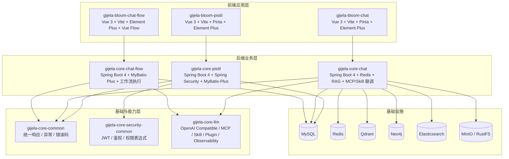

# gijela


gijela 是一个面向企业管理与 AI 应用联调的单仓项目，包含后台管理（pistil）、聊天应用（chat）与流程编排（chat-flow）三条主线，采用“后端多模块 + 前端多应用 + 文档治理”的协作模式。

这个仓库里最核心的一件事，是围绕大模型能力做了一套可独立演进的 Java 工具链：基于 Spring Boot 4 + OkHttp 自研了 `gijela-core-llm`，把大模型调用、MCP、Skills、插件扩展、可观测性等能力拆成了清晰的 SDK 模块；在此基础上，`gijela-core-chat` 作为功能验证与联调载体，用来持续检查整套 LLM 工具链是否完整、是否可接入真实业务；`gijela-core-chat-flow` 则进一步向上抽象，做了一个“大模型工作流执行”的最小闭环，用于验证从流程定义、节点编排、运行调试到结果回看的完整链路。

## 项目摘要

> 这是一个围绕 **自研大模型调用基础设施** 展开的工程仓库：底层用 `gijela-core-llm` 做 LLM / MCP / Skill / Plugin 能力沉淀，中间用 `gijela-core-chat` 做真实服务联调验证，上层用 `gijela-core-chat-flow` 做流程化执行闭环验证，同时保留 `pistil` 作为企业后台承载环境。

## English Summary

`gijela` is a mono-repo focused on engineering-oriented LLM integration in Java.

- `gijela-core-llm` is a self-built LLM toolkit based on Spring Boot 4 and OkHttp
- `gijela-core-chat` is the integration playground used to verify that the toolkit is complete and production-oriented
- `gijela-core-chat-flow` is the minimal workflow execution loop built on top of the LLM capabilities
- `pistil` provides the admin-side business shell for future system integration

## 一句话看懂

- 这是一个 **以自研 LLM 工具链为核心** 的单仓工程
- `gijela-core-llm` 负责 **大模型调用基础设施**
- `gijela-core-chat` 负责 **验证这套能力是否真的能跑进业务服务**
- `gijela-core-chat-flow` 负责 **验证这套能力是否能支撑流程化执行**
- `pistil` 负责 **提供企业后台承载环境与系统管理骨架**

## README 导航

- 想快速知道仓库做了什么：看“[这套项目重点在做什么](#这套项目重点在做什么)”
- 想快速理解模块分层：看“[模块关系](#模块关系)”
- 想快速理解系统结构：看“[架构示意图](#架构示意图)”
- 想快速启动本地环境：看“[快速启动（Windows / PowerShell）](#快速启动windows--powershell)”
- 想看后续规划：看“[Roadmap](#roadmap)”

## 本仓库完成了什么

如果从“做成了什么”来看，这个仓库里最核心的工作可以概括为四件事：

1. **自研了一套 Java 大模型调用工具链**  
	基于 Spring Boot 4 + OkHttp，自行拆分并实现了 `gijela-core-llm`，覆盖模型调用、MCP、Skill、Plugin、Observability 等关键能力。

2. **把工具链放进真实服务做完整性验证**  
	不是停留在 SDK 层，而是通过 `gijela-core-chat` 去验证会话、检索、附件、工具调用、Skills、MCP 等能力能否一起工作。

3. **把 LLM 能力推进到流程化执行层**  
	通过 `gijela-core-chat-flow`，把单次模型调用继续向上抽象成工作流定义、调试、运行、回看的最小闭环。

4. **预留了企业级后台承载入口**  
	通过 `pistil` 提供用户、角色、菜单、权限、审计等后台骨架，为未来 AI 能力真正进入业务系统预留管理面。

## 项目结构

```text
gijela/
├─ gijela-core/                         # 后端（Maven 多模块）
│  ├─ gijela-core-common                # 通用响应/异常/错误码
│  ├─ gijela-core-security-common       # JWT/鉴权/权限表达式
│  ├─ gijela-core-pistil                # 管理后台主业务
│  ├─ gijela-core-chat                  # LLM 能力联调与验证服务（RAG / Skill / MCP / 会话编排）
│  ├─ gijela-core-chat-flow             # 大模型工作流执行最小闭环后端
│  └─ gijela-core-llm/                  # 自研 LLM SDK 聚合（core/openai/plugin/obs/skill/mcp）
├─ gijela-bloom/                        # 前端（Vue3 + Vite 多应用）
│  ├─ gijela-bloom-pistil               # 管理后台前端
│  ├─ gijela-bloom-chat                 # 聊天前端
│  └─ gijela-bloom-chat-flow            # 编排前端
├─ docs/requirements/                   # 需求/评审/缺陷/归档文档体系
└─ skills/                              # 本地 Skill 目录（供 chat 模块加载）
```

## 技术栈（概览）

- 后端：Java 17、Spring Boot 4、Spring Security、MyBatis-Plus、Redis、JWT、Springdoc OpenAPI
- AI 相关：基于 OkHttp 的 OpenAI 兼容调用、自研 MCP Client、Skill 本地加载与注册、插件 SPI、可观测性事件、Qdrant、Neo4j、Elasticsearch
- 前端：Vue 3、TypeScript、Vite、Pinia、Axios、Element Plus、Vue Flow（chat-flow 可视化编排）
- 工程化：Maven 多模块、pnpm 多前端子项目、统一需求文档工作流

## 这套项目重点在做什么

### 1. 自研 `gijela-core-llm`：一套可扩展的大模型调用基础设施

`gijela-core-llm` 是整个仓库最重要的技术内核，不是简单封装第三方 SDK，而是基于 Spring Boot 4 + OkHttp 自己拆分实现的一套 LLM 能力层，目标是让“大模型接入能力”在业务系统里具备可维护、可扩展、可观测的工程形态。

当前已经拆成以下几个子模块：

- `gijela-core-llm-sdk-core`：统一模型抽象、基础协议与核心领域对象
- `gijela-core-llm-sdk-openai-compatible`：基于 OkHttp 实现 OpenAI 兼容协议调用
- `gijela-core-llm-sdk-plugin`：插件 SPI 与热插拔管理能力
- `gijela-core-llm-sdk-observability`：指标、审计、预算事件等可观测能力
- `gijela-core-llm-sdk-skill`：Skill 抽象、Provider / Registry、本地 `SKILL.md` 加载
- `gijela-core-llm-sdk-mcp`：MCP 客户端、JSON-RPC、SSE / stdio transport 与 Skill 桥接

这部分能力解决的不是“能不能调通一个模型接口”，而是：

- 如何统一接入不同 OpenAI 兼容模型服务
- 如何把工具调用、MCP、Skills 组织成稳定的扩展层
- 如何在 Java / Spring Boot 业务项目中以模块化方式复用
- 如何给模型调用链路补齐观测、审计和后续治理能力

### 2. `gijela-core-chat`：为验证 `gijela-core-llm` 完整性而建立的联调场

`gijela-core-chat` 不是单纯的聊天 Demo，而是专门为验证 `gijela-core-llm` 是否真正可落地而建立的测试与联调模块。

它承担的职责包括：

- 验证大模型调用链路是否可用
- 验证 Skill 扫描、注册、调用是否闭环
- 验证 MCP 接入、工具暴露、会话交互是否正常
- 验证 Redis 会话存储、附件处理、知识检索等外围能力是否能与 LLM 工具层协同工作
- 验证在真实 BFF 风格业务服务里，整套 LLM SDK 是否足够完整

实现上，`gijela-core-chat` 主要基于以下技术：

- Spring Boot 4：承载 Web API、配置体系与模块集成
- OkHttp：承接底层大模型 / MCP 网络通信
- Redis：做会话与上下文存储
- MyBatis-Plus + MySQL：做业务数据持久化
- Qdrant：做向量检索 / RAG 数据召回
- Neo4j：做图谱相关能力验证
- Elasticsearch：做检索或可观测相关扩展验证
- Springdoc OpenAPI：输出接口文档，支撑联调

对应前端 `gijela-bloom-chat` 则基于 Vue 3 + TypeScript + Vite + Pinia + Element Plus，实现聊天联调界面，用于直接验证后端能力是否能跑通。

### 3. `gijela-core-chat-flow`：大模型工作流执行的最小闭环

如果说 `gijela-core-chat` 关注的是“LLM 基础能力是否完整”，那么 `gijela-core-chat-flow` 关注的就是“如何把 LLM 能力编排成流程并真正执行”。

这个模块的目标不是一开始就做成复杂的企业级工作流平台，而是先构建一个最小闭环，覆盖：

- 工作流定义
- 节点与边的编排关系
- 流程校验
- 调试运行
- 正式运行
- 运行历史与结果回看

后端实现主要基于：

- Spring Boot 4：提供工作流 API 与执行入口
- MyBatis-Plus + Druid + MySQL：持久化工作流定义与运行数据
- Jackson：处理流程结构 JSON 与节点配置序列化
- `gijela-core-llm-sdk-openai-compatible`：作为底层模型能力接入层

前端 `gijela-bloom-chat-flow` 使用 Vue 3 + TypeScript + Vite + Element Plus，并通过 Vue Flow 实现工作流节点可视化编排，形成从“定义 → 调试 → 执行 → 查看结果”的闭环界面。

### 4. `pistil`：管理后台主业务与基础能力承载层

除了 AI 相关模块，仓库里还有 `gijela-core-pistil` + `gijela-bloom-pistil` 这一套管理后台主线，用于承载系统级基础能力，包括：

- 登录认证
- RBAC 权限控制
- 用户 / 角色 / 菜单 / 部门 / 岗位管理
- 审计日志
- 动态菜单与前后端权限联动

这部分为整个仓库提供了典型企业后台的基础骨架，也为后续把 AI 能力接入正式业务系统提供了承载环境。

## 项目亮点

- **自研 LLM 工具链**：不是简单依赖现成 AI SDK，而是基于 Spring Boot 4 + OkHttp 自己实现了可拆分、可扩展的 `gijela-core-llm`
- **模块边界清晰**：`core`、`openai-compatible`、`plugin`、`observability`、`skill`、`mcp` 分层明确，便于独立演进
- **从 SDK 到业务闭环**：不仅有能力层，还用 `chat` 做联调验证、用 `chat-flow` 做工作流执行验证
- **兼顾工程化与业务化**：既能验证模型调用，也能落到后台系统、工作流编排和管理平台场景
- **多扩展点设计**：支持 OpenAI 兼容模型、MCP 工具接入、本地 Skill 加载、插件扩展和后续治理能力演进
- **前后端分层明确**：后端负责能力编排与业务接口，前端负责联调验证、管理操作与可视化流程编排

## 为什么这个仓库有价值

很多项目只做到“把模型 API 调通”，但这个仓库更关注 **LLM 能力如何被工程化、模块化、可验证地接入业务系统**。

它的价值在于：

- 不把大模型接入停留在脚本或临时 Demo 层
- 不把工具调用、MCP、Skill 当成零散功能点，而是统一放进一套能力体系
- 不只关注单次对话，而是继续推进到工作流编排与后台承载
- 给后续接入企业权限、菜单、运营、审计等正式系统能力预留了清晰落点

## 模块关系

可以把整个仓库理解成“三层结构”：

### 第一层：基础与安全层

- `gijela-core-common`：统一响应、异常、错误码等公共基础设施
- `gijela-core-security-common`：JWT、认证鉴权、权限表达式、统一安全链路

这层负责给上层业务模块提供统一的基础约束。

### 第二层：LLM 能力层

- `gijela-core-llm` 及其各个 SDK 子模块

这层负责封装大模型调用、MCP、Skill、插件机制、可观测能力，是整个 AI 能力体系的核心。

### 第三层：业务验证与承载层

- `gijela-core-chat`：验证 LLM 能力是否能在真实聊天场景里跑通
- `gijela-core-chat-flow`：验证 LLM 能力是否能支撑工作流编排与执行闭环
- `gijela-core-pistil`：提供管理后台业务骨架，为系统级能力落地提供承载环境

对应前端：

- `gijela-bloom-chat`：聊天联调前端
- `gijela-bloom-chat-flow`：工作流编排前端
- `gijela-bloom-pistil`：管理后台前端

## 调用链路理解

### 1. LLM 能力验证链路

```text
gijela-bloom-chat
	↓
gijela-core-chat
	↓
gijela-core-llm
	├─ openai-compatible：模型调用
	├─ skill：技能注册与加载
	├─ mcp：工具协议接入
	├─ plugin：扩展能力管理
	└─ observability：调用观测与审计
```

这条链路的重点是验证：模型能不能调、Skill 能不能注册、MCP 能不能接入、整条调用链能不能在一个真实服务里稳定协同。

### 2. 工作流执行链路

```text
gijela-bloom-chat-flow
	↓
gijela-core-chat-flow
	↓
工作流定义 / 校验 / 调试 / 运行
	↓
gijela-core-llm
	↓
底层大模型能力
```

这条链路的重点是验证：大模型能力能否从“单次调用”升级为“节点化、流程化、可追踪”的执行体系。

### 3. 后台承载链路

```text
gijela-bloom-pistil
	↓
gijela-core-pistil
	↓
gijela-core-security-common + gijela-core-common
```

这条链路的重点是提供标准后台能力，包括登录、菜单、角色、权限、审计等，为后续 AI 业务接入正式后台系统提供基础设施。

## 适合怎么理解这个仓库

如果从研发目标看，这个仓库不是单一业务系统，而是一个同时覆盖以下三个目标的工程集合：

1. **做一套自己的大模型 Java 工具链**：`gijela-core-llm`
2. **验证这套工具链是否真的可用**：`gijela-core-chat`
3. **把这套能力推进到流程化执行**：`gijela-core-chat-flow`

而 `pistil` 则提供了一个更贴近企业正式系统的后台承载面，帮助整套能力未来接入真实业务时不至于停留在 Demo 阶段。

## 架构示意图



## 模块职责速览

| 模块 | 技术实现 | 主要职责 |
|---|---|---|
| `gijela-core-common` | Java 17 | 统一返回体、异常、错误码等公共基础能力 |
| `gijela-core-security-common` | Spring Security + JWT + Redis | 认证鉴权、权限表达式、安全上下文与统一安全链路 |
| `gijela-core-pistil` | Spring Boot 4 + MyBatis-Plus + MySQL | 企业后台主业务，承载用户、角色、菜单、部门、岗位、审计等能力 |
| `gijela-core-llm` | Spring Boot 4 + OkHttp | 自研大模型调用基础设施，提供 OpenAI 兼容调用、MCP、Skill、插件、观测能力 |
| `gijela-core-chat` | Spring Boot 4 + Redis + Qdrant + Neo4j + ES | 作为 LLM 能力验证场，联调模型调用、RAG、MCP、Skill、附件与会话能力 |
| `gijela-core-chat-flow` | Spring Boot 4 + MyBatis-Plus + Jackson | 构建大模型工作流执行最小闭环，覆盖定义、校验、调试、运行、回看 |
| `gijela-bloom-pistil` | Vue 3 + TypeScript + Vite + Pinia + Element Plus | 管理后台前端，承接 RBAC 与系统管理页面 |
| `gijela-bloom-chat` | Vue 3 + TypeScript + Vite + Pinia + Element Plus | 聊天联调前端，用于验证 LLM 相关后端能力 |
| `gijela-bloom-chat-flow` | Vue 3 + TypeScript + Vite + Element Plus + Vue Flow | 工作流编排前端，提供流程设计、调试与运行界面 |

## 项目价值

从工程目标上看，这个仓库的价值不只是“做了几个模块”，而是把大模型能力从底层调用一路推进到了可验证、可编排、可接入业务系统的形态：

- **向下**，完成了 Java 侧自研 LLM 工具链沉淀，而不是完全依赖外部 SDK
- **向中间**，通过 `chat` 把模型调用、MCP、Skill、RAG 等能力组织成可联调的业务服务
- **向上**，通过 `chat-flow` 把大模型能力推进到流程化执行层
- **向业务侧**，通过 `pistil` 预留了正式系统接入和后台承载的落点

换句话说，这个仓库体现的是一条完整路线：

**从大模型基础设施研发，到业务验证，再到流程化编排与企业系统承载。**

## Roadmap

下面这些方向很适合继续作为 `gijela-core-llm` 与整仓演进重点：

### 1. `gijela-core-llm` 持续增强

- 补齐更多模型协议与供应商适配能力
- 完善流式输出、重试、超时、限流、降级等治理机制
- 增强插件 SPI、Skill Registry、MCP 工具发现与生命周期管理
- 补充更完整的调用指标、日志审计、成本统计与链路追踪

### 2. `gijela-core-chat` 向真实业务联调演进

- 完善多轮会话管理、上下文压缩与摘要策略
- 增强附件处理、知识入库、检索召回与答案融合链路
- 继续作为 `gijela-core-llm` 的集成验证场，覆盖更多真实调用场景

### 3. `gijela-core-chat-flow` 向可编排平台演进

- 增加更多节点类型、执行策略与失败补偿机制
- 完善运行态观测、节点日志、调试信息与结果回放
- 逐步从“最小闭环”演进到“可扩展工作流引擎”

### 4. 与正式后台系统进一步融合

- 将 AI 配置、模型管理、工具管理、流程管理逐步纳入 `pistil`
- 把权限、菜单、审计、运营配置与 AI 能力后台统一起来
- 形成从基础设施、业务验证到后台运营的一体化管理面

## 适合谁看这个仓库

- 想用 Java / Spring Boot 自己做一套大模型调用基础设施的人
- 想把 MCP、Skill、RAG 等能力真正接入业务系统的人
- 想验证“大模型调用”如何升级成“工作流编排执行”的人
- 想在企业后台体系中承载 AI 能力的人

## 核心能力清单

### `gijela-core-llm`

- OpenAI 兼容协议调用
- 基于 OkHttp 的统一网络调用封装
- MCP Client 与 JSON-RPC 通信支持
- SSE / stdio transport 接入能力
- Skill 抽象、注册、加载与桥接能力
- Plugin SPI 扩展机制
- 可观测性事件、审计、预算与后续治理扩展位

### `gijela-core-chat`

- 聊天接口联调
- 会话上下文存储
- RAG / 向量检索验证
- 本地 Skills 加载与调用验证
- MCP 工具接入验证
- 附件、对象存储、图谱与检索链路联调

### `gijela-core-chat-flow`

- 工作流定义与保存
- 节点/边编排
- 流程校验
- 调试运行
- 正式运行
- 运行历史与结果回看

### `pistil`

- 登录认证
- RBAC 权限控制
- 动态菜单
- 用户 / 角色 / 部门 / 岗位管理
- 审计日志与后台管理能力

## 项目定位总结

如果要用一句更完整的话来概括，这个仓库的定位是：

**以 `gijela-core-llm` 为核心，自研 Java 大模型调用基础设施，并通过 `gijela-core-chat` 完成功能完整性验证，通过 `gijela-core-chat-flow` 完成流程化执行闭环验证，再通过 `pistil` 提供企业后台承载环境。**

所以，这个项目不是单纯的后台系统，也不是单纯的聊天 Demo，更不是只做了一层模型 API 封装；它本质上是一套围绕“大模型能力工程化落地”逐层展开的仓库：

- 最底层做能力抽象与协议实现
- 中间层做联调验证与真实服务接入
- 上层做流程化编排
- 旁路提供企业后台承载与运营入口

这也是这个仓库最有辨识度的地方：**不是只验证模型能调用，而是在验证一整套 LLM 基础设施如何真正进入业务系统。**

## 默认端口与服务映射

| 模块 | 后端端口 | 前端端口 | 说明 |
|---|---:|---:|---|
| pistil | 9006 | 5173 | 管理后台（用户/角色/菜单/部门/岗位/审计等） |
| chat | 9016 | 5174 | 聊天联调（会话、知识检索、附件等） |
| chat-flow | 9010 | 5175 | 流程编排（工作流定义、调试、运行） |

## 快速启动（Windows / PowerShell）

### 1) 环境准备

- JDK 17（项目编译目标为 17）
- Maven 3.9+
- Node.js（建议通过 nvm 管理）
- pnpm（前端统一包管理）
- 基础依赖：MySQL、Redis
- chat / chat-flow 联调按需准备：Qdrant、Neo4j、对象存储（MinIO/RustFS）、Elasticsearch

> 详细仓库协作指引见 [QUICK-START.md](QUICK-START.md)。

### 2) 后端启动（任选模块）

在仓库根目录执行：

```powershell
# pistil
mvn -f gijela-core/pom.xml -pl gijela-core-pistil -am install -DskipTests
mvn -f gijela-core/gijela-core-pistil/pom.xml spring-boot:run

# chat
mvn -f gijela-core/pom.xml -pl gijela-core-chat -am install -DskipTests
mvn -f gijela-core/gijela-core-chat/pom.xml spring-boot:run

# chat-flow
mvn -f gijela-core/pom.xml -pl gijela-core-chat-flow -am install -DskipTests
mvn -f gijela-core/gijela-core-chat-flow/pom.xml spring-boot:run
```

### 3) 前端启动（对应子项目）

```powershell
# pistil 前端
Set-Location .\gijela-bloom\gijela-bloom-pistil
pnpm install
pnpm dev

# chat 前端
Set-Location ..\gijela-bloom-chat
pnpm install
pnpm dev

# chat-flow 前端
Set-Location ..\gijela-bloom-chat-flow
pnpm install
pnpm dev
```

## 配置说明（重点）

- pistil 配置：`gijela-core/gijela-core-pistil/src/main/resources/application*.yml`
- chat 配置：`gijela-core/gijela-core-chat/src/main/resources/application*.yml`
- chat-flow 配置：`gijela-core/gijela-core-chat-flow/src/main/resources/application*.yml`
- 数据库连接、Redis、对象存储、图数据库等均支持通过环境变量覆盖默认值。

其中：

- `pistil` 默认使用 MySQL，端口为 9006
- `chat` 默认使用 MySQL + Redis，并可按需接入 Qdrant、Neo4j、对象存储、Elasticsearch，端口为 9016
- `chat-flow` 默认使用 MySQL，端口为 9010，重点验证工作流定义与执行闭环

## 文档与协作流程

- 仓库总览：`QUICK-START.md`
- 需求治理：`docs/requirements/`
- 工作流说明：`.github/requirements-workflow.md`
- 前端 API 约定：`gijela-bloom/gijela-bloom-pistil/api-conventions.md`

协作遵循：Backlog → Active（REQ）→ ARCH-REVIEW → 实现 → BUG → Archive。

## 常见问题（FAQ）

### Q1：这个仓库的主目标是做业务系统，还是做 LLM SDK？

两者都有，但主轴是 **先把 LLM 基础设施做扎实**。`gijela-core-llm` 是能力核心，`chat` 和 `chat-flow` 是验证与落地路径，`pistil` 是后台承载面。

### Q2：如果我只想体验 LLM 工具链，最少需要启动哪些模块？

建议最小组合是：

- 后端：`gijela-core-chat`
- 前端：`gijela-bloom-chat`

如果要体验流程编排，再额外启动 `gijela-core-chat-flow` + `gijela-bloom-chat-flow`。

### Q3：如果我只想看后台管理能力，启动哪些模块？

启动 `gijela-core-pistil` + `gijela-bloom-pistil` 即可。

### Q4：为什么同时保留 chat 与 chat-flow？

- `chat` 侧重验证“能力是否完整可用”
- `chat-flow` 侧重验证“能力是否可流程化执行”

两者关注点不同，组合后才能覆盖从 SDK 到业务编排的完整链路。

## 贡献建议

- 新需求、评审、缺陷文档统一放在 `docs/requirements/`
- 先补文档，再改代码，保持需求链路可追溯
- 尽量做最小必要改动，避免无关重构与大面积格式化
- 变更接口、权限、配置时，记得同步更新相关文档

## 适用场景

- 企业后台系统（RBAC + 菜单权限 + 审计）
- AI 聊天/知识检索联调平台
- 可视化工作流编排与执行联调
- LLM SDK 与 MCP/Skill 能力扩展验证

## 安全与合规

- 严禁提交真实密钥、令牌、账号密码等敏感信息。
- 默认配置中的示例密码仅用于本地开发，请在实际环境通过环境变量替换。

## License

[LICENSE](LICENSE)
