# gijela-core-chat-flow 用户手册

> 适用对象：产品演示、联调开发、测试验证、问题排查。

## 封面摘要

如果你第一次接触 `gijela-core-chat-flow`，先看这三点：

- 这是什么：一套“流程编排 + LLM 调试 + 会话验证 + 运行追踪”的联调工作台
- 访问地址：前端 `http://localhost:5175/`
- 读完能做什么：独立完成模型配置、流程编排、调试发布、会话验证与运行排查

| 项 | 内容 |
|---|---|
| 文档版本 | v1.0.0 |
| 更新时间 | 2026-05-25 |
| 前端模块 | `gijela-bloom/gijela-bloom-chat-flow` |
| 后端模块 | `gijela-core/gijela-core-chat-flow` |
| 目标读者 | 联调开发、测试、演示、维护同学 |

---

## 目录

- [0. 使用说明](#0-使用说明)
- [1. 前置检查](#1-前置检查)
- [2. 模块与端口映射](#2-模块与端口映射)
- [3. 页面入口总览](#3-页面入口总览)
- [4. 快速上手（10分钟）](#4-快速上手10分钟)
- [5. 模块操作说明](#5-模块操作说明)
  - [4.1 工作流空间](#41-工作流空间)
  - [4.2 模型维护](#42-模型维护)
  - [4.3 流程编辑器](#43-流程编辑器)
  - [4.4 会话工作台](#44-会话工作台)
  - [4.5 运行历史页](#45-运行历史页)
- [6. 推荐联调路径](#6-推荐联调路径)
- [7. 常见问题](#7-常见问题)
- [8. 关键接口清单](#8-关键接口清单)
- [9. 数据初始化与配置位置](#9-数据初始化与配置位置)
- [10. 一键校验命令（PowerShell）](#10-一键校验命令powershell)

---

## 0. 使用说明

阅读建议：

1. 第一次接触，先按“快速上手（10分钟）”走通主链路。
2. 卡在某一步时，直接跳到“常见问题”。
3. 做回归或演示时，重点看“推荐联调路径”。

边界说明：

- 本手册基于本地开发环境，前端地址为 `http://localhost:5175/`。
- 后端默认端口为 `9010`，前端通过 `/api` 代理到后端。
- 文中“发布流程”是会话调用流程的前置条件。

---

## 1. 前置检查

已知你本地服务已启动，建议再做两步健康确认：

1. 打开前端：`http://localhost:5175/`
2. 健康检查接口：`GET /api/v1/chat-flow/health`

如果前端可打开但接口报错，优先确认后端端口是否为 `9010`（默认）。

---

## 2. 模块与端口映射

前后端对应关系：

- 前端：`gijela-bloom/gijela-bloom-chat-flow`
  - 默认端口：`5175`
  - Vite 代理：`/api -> http://localhost:9010`
- 后端：`gijela-core/gijela-core-chat-flow`
  - 默认端口：`9010`
  - 接口前缀：`/api/v1/chat-flow/**`

建议先确认两件事：

1. 前端能打开：`http://localhost:5175/`
2. 后端健康接口正常：`/api/v1/chat-flow/health`

---

## 3. 页面入口总览

系统核心路由如下：

- `/workflows`：流程列表（工作流空间）
- `/llm-models`：模型维护
- `/workflows/:id/editor`：流程编辑联调页
- `/workflows/:id/runs`：流程运行历史页
- `/chat-workbench`：会话工作台（会话 + 消息 + 执行追踪）

<p align="center">
  
</p>
<p align="center"><em>图 3-1 工作流空间首页（/workflows）</em></p>

---

## 4. 快速上手（10分钟）

按下面顺序操作，最容易一次走通：

1. 进入“模型维护”新增一条启用模型。
2. 返回“流程列表”新建流程。
3. 进入流程编辑器，放置 `开始 -> LLM -> 结束` 三个节点。
4. 配置 LLM 节点模型，保存草稿，点击“校验”。
5. 点击“调试”，查看“调试面板”确认节点执行成功。
6. 点击“发布”。
7. 进入“会话工作台”，新建会话并关联刚发布的流程。
8. 发送一条消息，查看右侧“执行面板”和“运行历史”。

能完成以上步骤，即表示主链路已打通。

---

## 5. 模块操作说明

### 4.1 工作流空间

入口：`/workflows`

主要功能：

- 新建流程
- 查看流程卡片（状态、类型、描述、ID）
- 进入编辑器
- 查看运行历史
- 删除流程

操作建议：

- 流程命名建议体现业务场景，例如“客服问答流程”“检索增强流程”。
- 删除前先确认是否已有会话正在使用该流程。

<p align="center">
  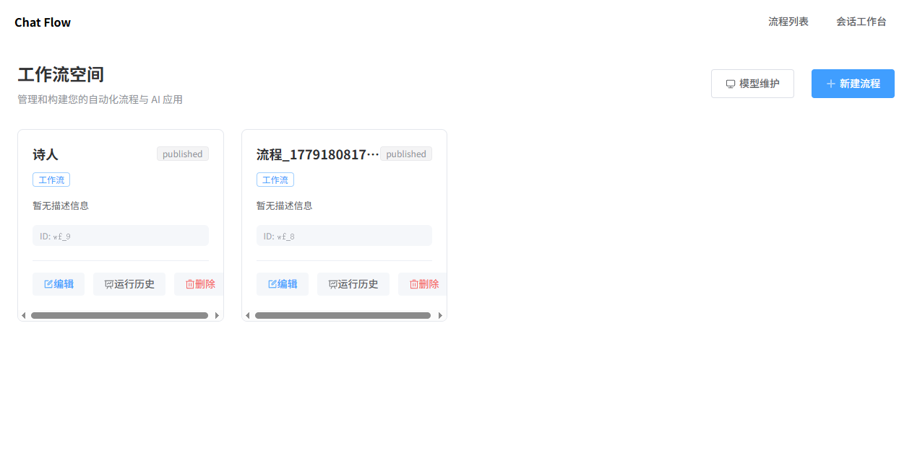
</p>
<p align="center"><em>图 4-1-1 工作流列表状态视图（草稿/发布状态查看）</em></p>

---

### 4.2 模型维护

入口：`/llm-models`

主要字段：

- `模型键 modelKey`：系统内稳定标识（建议唯一且语义清晰）
- `展示名称 displayName`
- `模型URL baseUrl`
- `API Key`
- `目标模型 targetModel`
- `是否启用 enabled`
- `默认温度 / 默认 MaxTokens`

常见用法：

- 新增模型：用于流程节点下拉选择
- 编辑模型：切换供应商地址或模型名
- 停用模型：保留记录但不允许新节点继续选用

注意：

- LLM 节点下拉为空，通常是“没有启用模型”。

<p align="center">
  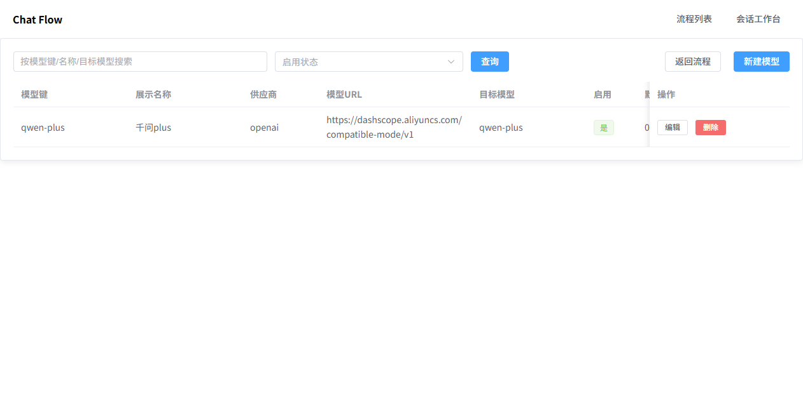
</p>
<p align="center"><em>图 4-2 模型维护页面（/llm-models）</em></p>

<p align="center">
  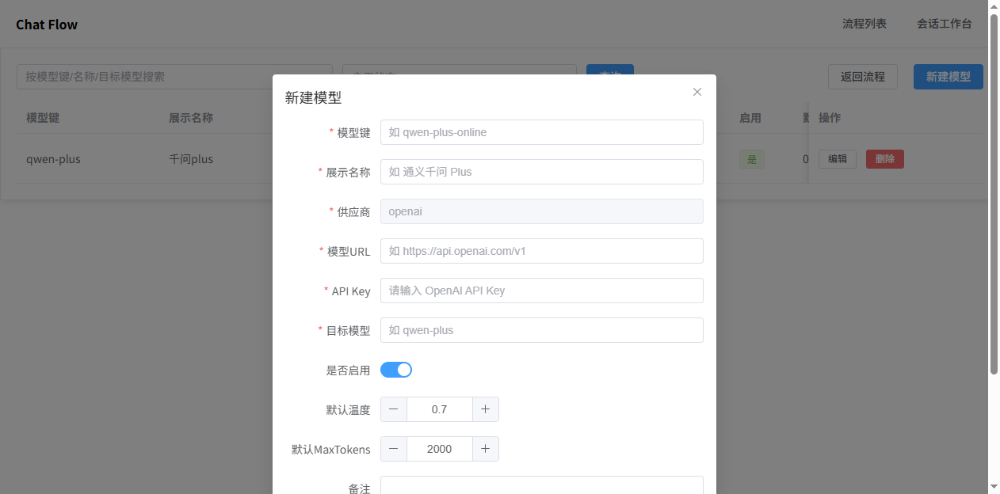
</p>
<p align="center"><em>图 4-2-1 新建模型弹窗</em></p>

---

### 4.3 流程编辑器

入口：`/workflows/{workflowId}/editor`

#### 4.3.1 顶部工具栏

- 更新名称
- 保存（草稿）
- 校验
- 调试
- 发布
- 调试面板
- 连线日志
- 查看 JSON

#### 4.3.2 画布区

左侧节点库默认支持：

- 开始节点（Start）
- LLM 节点（LLM）
- 结束节点（End）

支持拖拽到画布，支持节点连线、删节点、删连线。

#### 4.3.3 右侧配置区

- 工作流入参：调试输入值
- 节点配置：
  - 输入模式（`chat` / `transform`）
  - 选择模型
  - 温度、MaxTokens
  - 提示词模板
  - 入参映射（前置节点/工作流入参/常量）

#### 4.3.4 调试与发布

- **调试**：用于当前草稿版本联调
- **发布**：将当前可用版本设为可被会话调用

建议顺序：`保存 -> 校验 -> 调试 -> 发布`

<p align="center">
  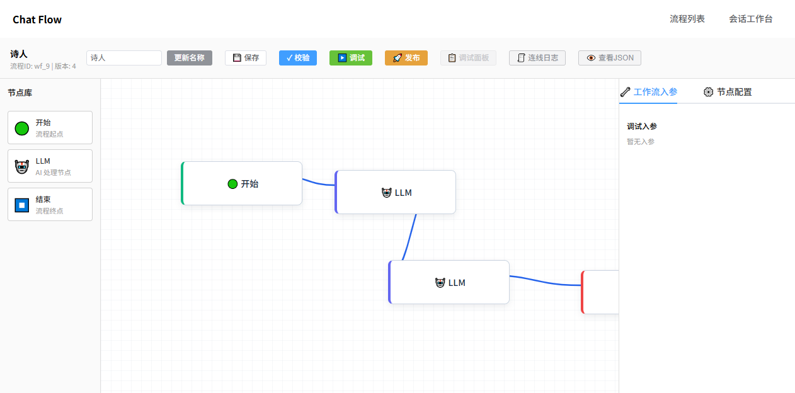
</p>
<p align="center"><em>图 4-3-2 发布前状态（点击发布按钮前）</em></p>

<p align="center">
  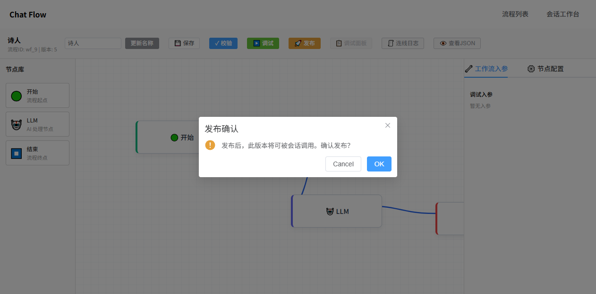
</p>
<p align="center"><em>图 4-3-3 发布后状态（点击发布按钮后）</em></p>

<p align="center">
  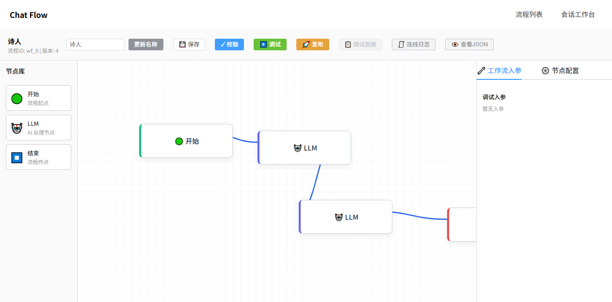
</p>
<p align="center"><em>图 4-3 流程编辑器页面（/workflows/{workflowId}/editor）</em></p>

<p align="center">
  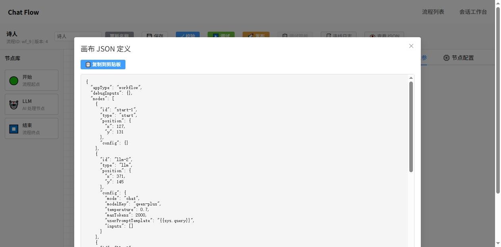
</p>
<p align="center"><em>图 4-3-1 查看 JSON 弹窗</em></p>

---

### 4.4 会话工作台

入口：`/chat-workbench`

页面结构：

- 左：会话列表（支持新建、编辑、删除、搜索）
- 中：消息窗口（显示 user / assistant）
- 右：执行面板（实时执行 + 运行历史）

会话新建关键项：

- 会话标题
- 关联工作流（仅可选“已发布流程”）
- 固定入参 JSON（可选）

发送消息后可查看：

- 最终结果 `finalResult`
- 节点级日志（节点状态、耗时、异常）
- 节点输入/输出快照（用于排查）

<p align="center">
  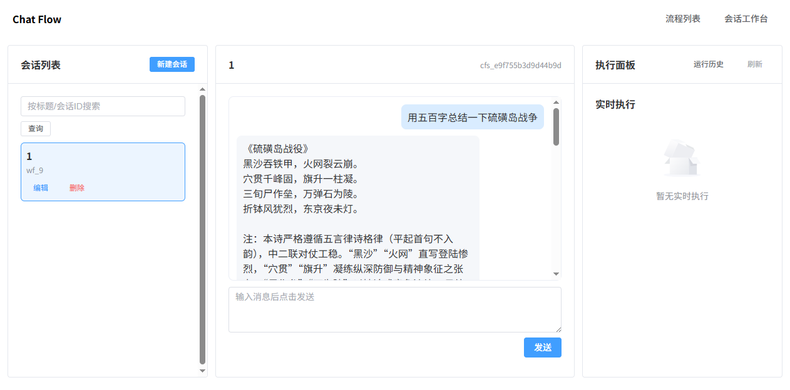
</p>
<p align="center"><em>图 4-4 会话工作台页面（/chat-workbench）</em></p>

<p align="center">
  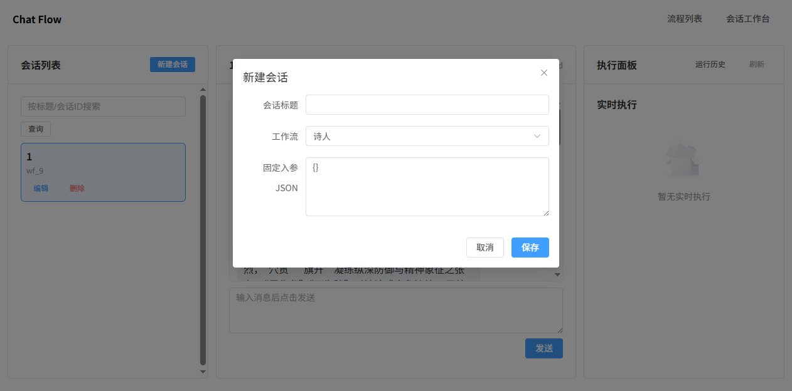
</p>
<p align="center"><em>图 4-4-1 新建会话弹窗</em></p>

<p align="center">
  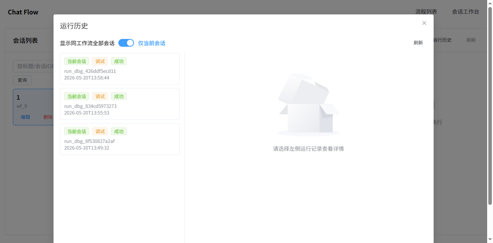
</p>
<p align="center"><em>图 4-4-2 会话工作台运行历史弹窗</em></p>

<p align="center">
  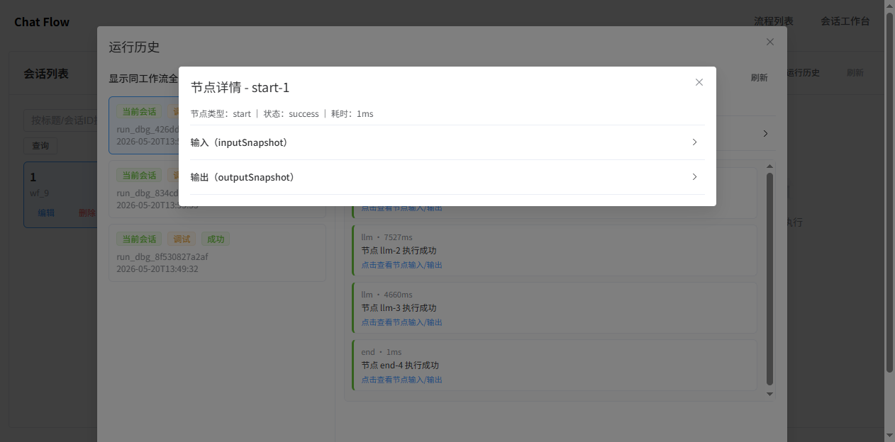
</p>
<p align="center"><em>图 4-4-3 节点详情弹窗（inputSnapshot / outputSnapshot）</em></p>

<p align="center">
  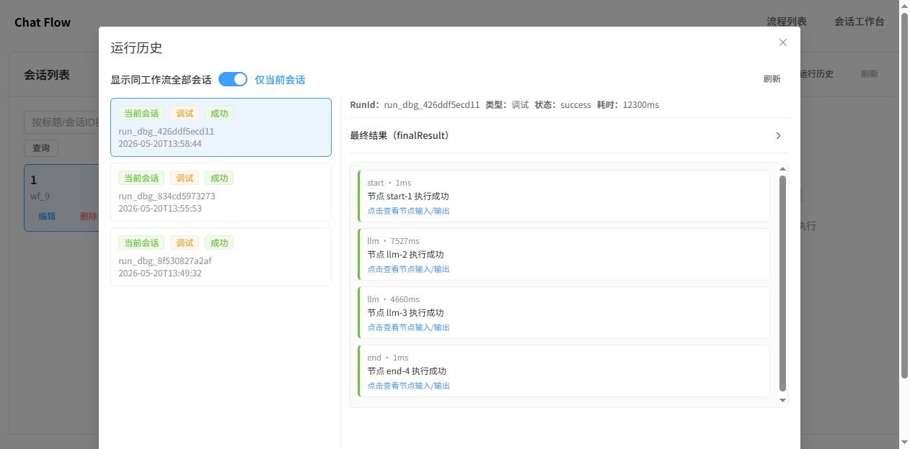
</p>
<p align="center"><em>图 4-4-4 运行历史选中记录详情视图</em></p>

---

### 4.5 运行历史页

入口：`/workflows/{workflowId}/runs`

功能：

- 按运行类型筛选（调试/正式）
- 按状态筛选（成功/失败/运行中）
- 分页查看
- 打开某次运行详情 JSON

适合场景：

- 回溯某次线上异常
- 对比调试运行与正式运行差异

<p align="center">
  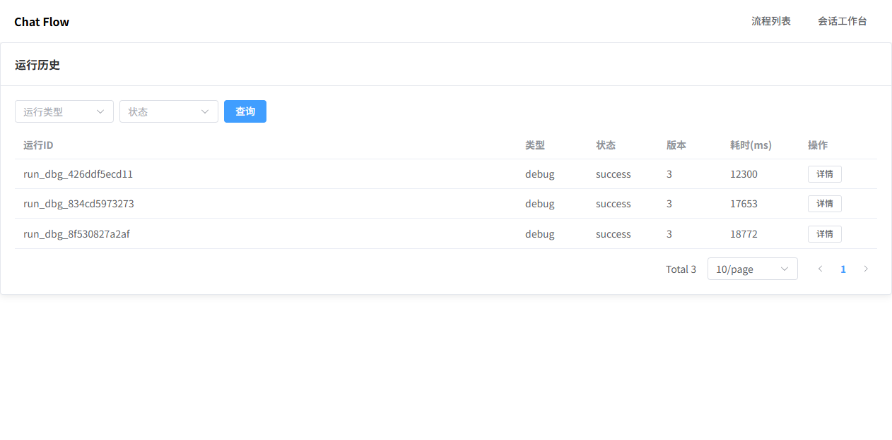
</p>
<p align="center"><em>图 4-5 运行历史页面（/workflows/{workflowId}/runs）</em></p>

<p align="center">
  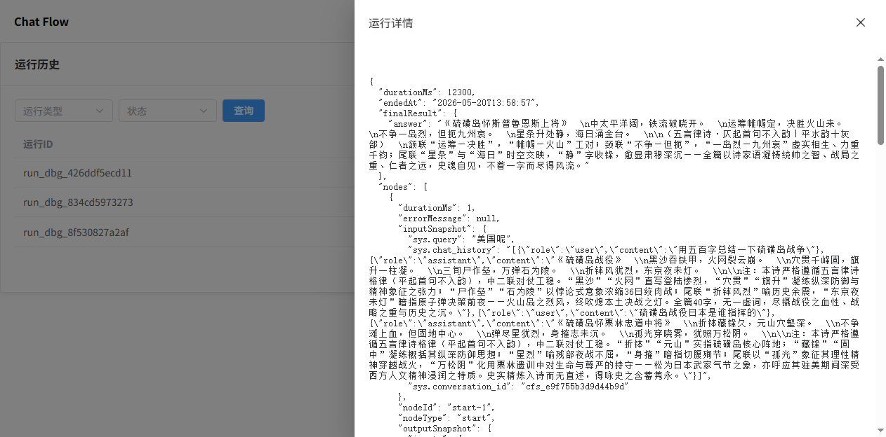
</p>
<p align="center"><em>图 4-5-1 运行详情抽屉（单次运行明细）</em></p>

---

## 6. 推荐联调路径

建议按“模型 -> 流程 -> 会话 -> 运行排查”的顺序推进：

1. 模型维护：保证至少 1 条可用模型
2. 流程编辑：完成基础 DAG（开始、LLM、结束）
3. 草稿调试：确认节点执行与结果输出
4. 发布流程：使会话可引用
5. 会话验证：发送真实问题并观察结果
6. 运行追踪：定位慢节点与失败节点

---

## 7. 常见问题

### Q1：会话新建时工作流下拉为空

原因：当前没有已发布流程。  
处理：去流程编辑器执行“发布”后再返回会话页。

### Q2：LLM 节点模型下拉为空

原因：模型维护中没有启用模型。  
处理：新增或启用模型。

### Q3：消息发送后长时间无响应

排查顺序：

1. 右侧执行面板是否有 `runId`
2. 节点是否失败（看节点状态与错误信息）
3. 模型 `baseUrl / apiKey / targetModel` 是否正确
4. 后端日志是否有上游超时

### Q4：流程保存后校验失败

常见原因：

- 缺少开始或结束节点
- 连线断开
- LLM 节点缺少模型配置
- 入参映射不完整

### Q5：前端页面打开了，但接口 404 / 502

排查顺序：

1. 确认后端是否启动在 `9010`。
2. 确认前端代理配置是否为 `/api -> http://localhost:9010`。
3. 直接访问健康接口：`http://localhost:9010/api/v1/chat-flow/health`。
4. 如后端接口正常但前端异常，重启前端开发服务。

---

## 8. 关键接口清单

### 工作流

- `GET /api/v1/chat-flow/workflows`
- `POST /api/v1/chat-flow/workflows`
- `GET /api/v1/chat-flow/workflows/{workflowId}`
- `PUT /api/v1/chat-flow/workflows/{workflowId}`
- `DELETE /api/v1/chat-flow/workflows/{workflowId}`
- `PUT /api/v1/chat-flow/workflows/{workflowId}/draft`
- `POST /api/v1/chat-flow/workflows/{workflowId}/validate`
- `POST /api/v1/chat-flow/workflows/{workflowId}/publish`
- `POST /api/v1/chat-flow/workflows/{workflowId}/debug-runs`
- `POST /api/v1/chat-flow/workflows/{workflowId}/runs`
- `GET /api/v1/chat-flow/workflows/{workflowId}/runs`
- `GET /api/v1/chat-flow/runs/{runId}`

### 模型维护

- `GET /api/v1/chat-flow/llm-models`
- `POST /api/v1/chat-flow/llm-models`
- `PUT /api/v1/chat-flow/llm-models/{id}`
- `DELETE /api/v1/chat-flow/llm-models/{id}`

### 会话工作台

- `GET /api/v1/chat-flow/chat/sessions`
- `POST /api/v1/chat-flow/chat/sessions`
- `PUT /api/v1/chat-flow/chat/sessions/{sessionId}`
- `DELETE /api/v1/chat-flow/chat/sessions/{sessionId}`
- `GET /api/v1/chat-flow/chat/sessions/{sessionId}/messages`
- `POST /api/v1/chat-flow/chat/completions`

### 健康检查

- `GET /api/v1/chat-flow/health`

---

## 9. 数据初始化与配置位置

- SQL 初始化脚本：`gijela-core/gijela-core-chat-flow/src/main/resources/db/init-chat-flow.sql`
- 后端默认端口配置：`gijela-core/gijela-core-chat-flow/src/main/resources/application.yml`
- 开发环境数据库配置：`gijela-core/gijela-core-chat-flow/src/main/resources/application-dev.yml`
- 前端端口与代理配置：`gijela-bloom/gijela-bloom-chat-flow/vite.config.ts`

如果你要新环境初始化，优先先执行初始化 SQL，再启动后端。

---

## 10. 一键校验命令（PowerShell）

以下命令可直接用于本地快速验证：

```powershell
# 1) 健康检查
Invoke-RestMethod -Uri "http://localhost:9010/api/v1/chat-flow/health" -Method Get

# 2) 查看流程列表
Invoke-RestMethod -Uri "http://localhost:9010/api/v1/chat-flow/workflows" -Method Get

# 3) 查看模型列表
Invoke-RestMethod -Uri "http://localhost:9010/api/v1/chat-flow/llm-models" -Method Get
```

如需初始化数据库（MySQL 命令行示例）：

```powershell
mysql -h 127.0.0.1 -P 3306 -u root -p < "gijela-core/gijela-core-chat-flow/src/main/resources/db/init-chat-flow.sql"
```

---

## 11. 截图索引

本手册已补充以下截图资源（目录：`doc/assets/chat-flow/`）：

1. `01-workflows.png`：工作流空间首页
2. `02-llm-models.png`：模型维护页面
3. `03-workflow-editor.png`：流程编辑器页面
4. `04-workflow-runs.png`：运行历史页面
5. `05-chat-workbench.png`：会话工作台页面
6. `06-llm-model-create-dialog.png`：新建模型弹窗
7. `07-workflow-json-dialog.png`：流程 JSON 查看弹窗
8. `08-chat-create-session-dialog.png`：新建会话弹窗
9. `09-chat-run-history-dialog.png`：会话工作台运行历史弹窗
10. `10-workflow-run-detail-drawer.png`：工作流运行详情抽屉
11. `11-chat-run-history-detail-panel.png`：会话工作台运行历史详情区
12. `12-chat-node-detail-dialog.png`：节点详情弹窗（输入输出快照）
13. `13-chat-run-history-selected-run.png`：会话工作台运行历史选中记录详情
14. `14-workflow-list-status.png`：工作流列表状态视图
15. `15-workflow-before-publish.png`：发布前流程编辑器状态
16. `16-workflow-after-publish.png`：发布后流程编辑器状态

后续可继续补充：

- 节点配置细节图（LLM 参数、入参映射）
- 调试面板展开图（节点输入/输出快照）
- 运行详情中的 finalResult 展开态截图