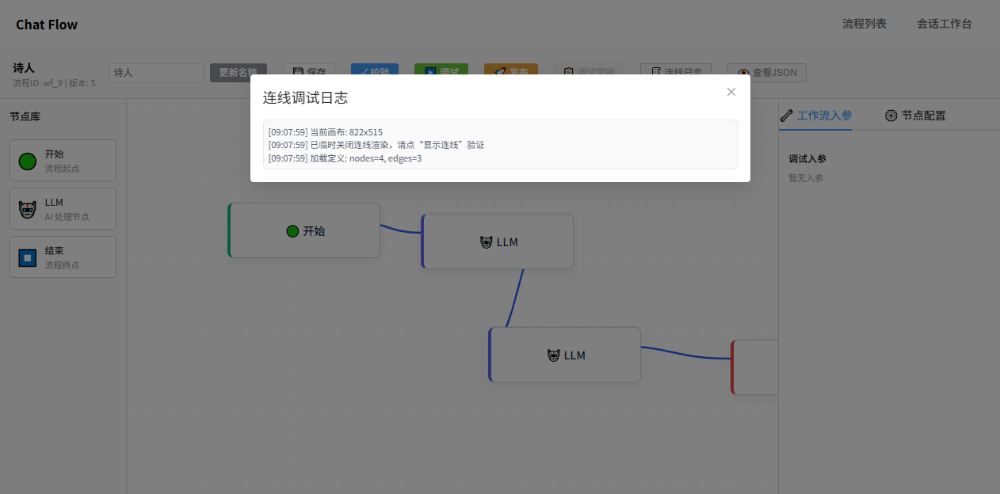
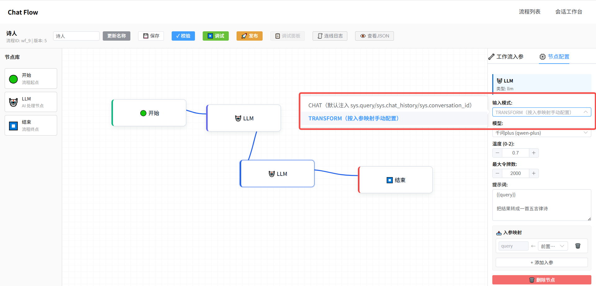
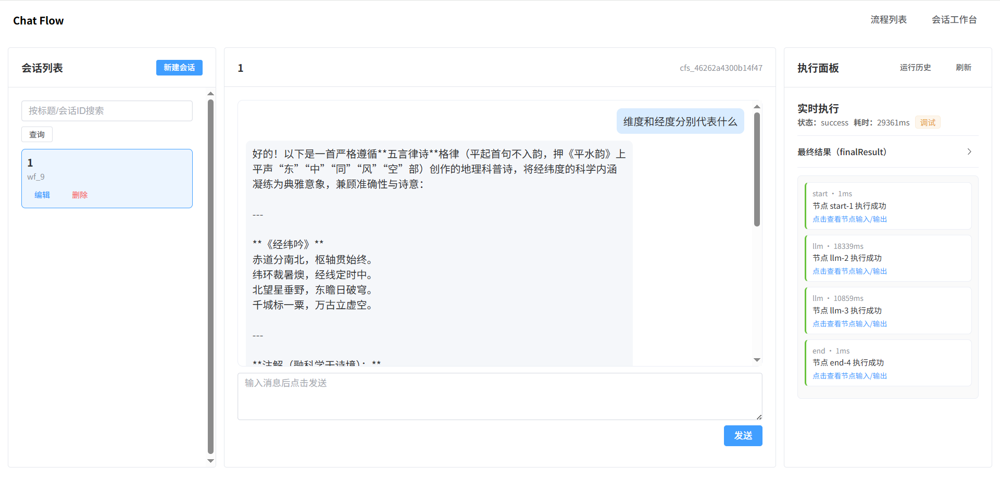
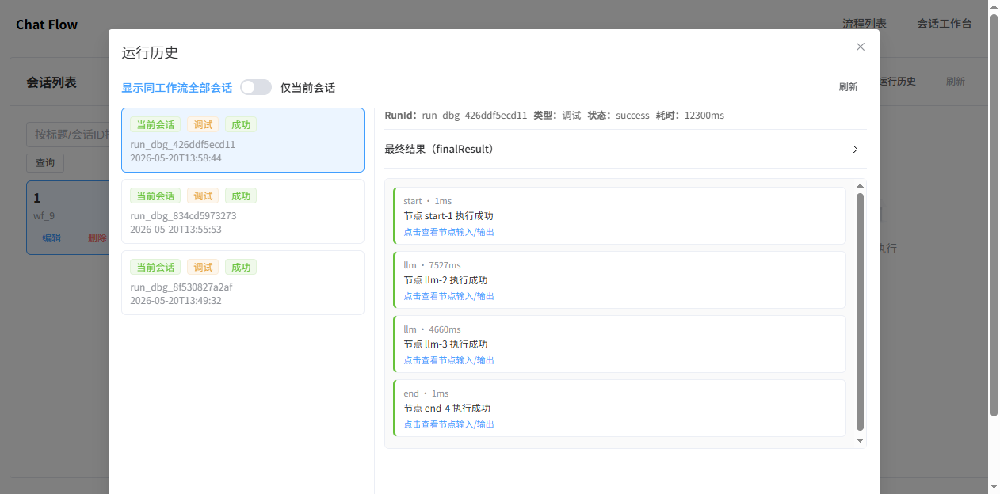
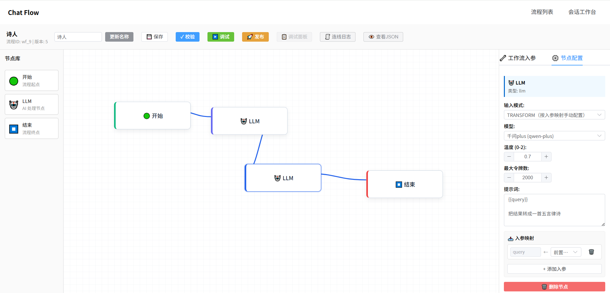
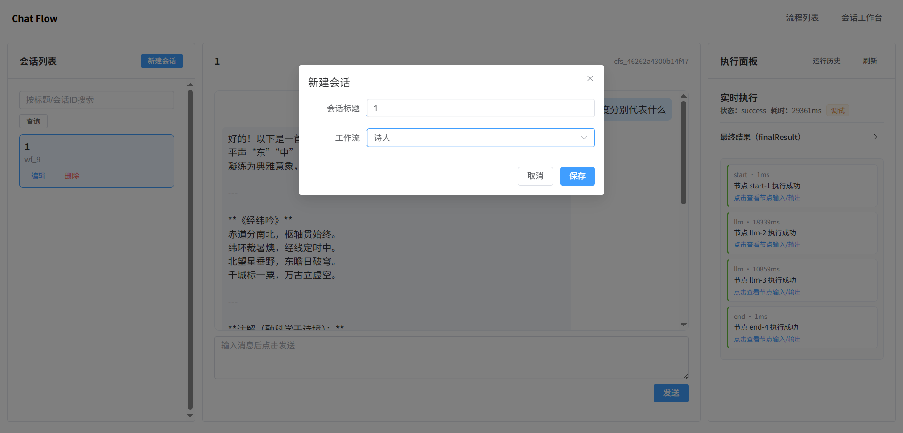

# 别再只做单点调用：`gijela-core-chat-flow` 把大模型编排、调试、运行、排障串成闭环

> 关键词：`chat-flow`、`工作流编排`、`LLM`、`Java`、`Spring Boot`、`Vue3`

如果你做过 LLM 项目，大概率都经历过这个阶段：

- 模型接口能调通，但链路一复杂就开始"拼脚本"
- 调试全靠日志和猜测，问题定位成本高
- 一旦交接给测试或同事，沟通成本立刻飙升

`gijela-core-chat-flow` 想解决的不是"再做一个页面"，而是把 **流程定义 → 节点编排 → 调试运行 → 结果回看 → 排障定位** 做成一个可视化闭环。

这篇文章我用实操视角，带你快速看完这套能力到底值不值得上手。

---

## 一、先看结论：这不是 Demo 页面，而是联调工作台

`gijela-core-chat-flow` 的定位很明确：

- 不是单次聊天调用
- 不是只做"流程画布"
- 而是让流程在真实后端里可调试、可发布、可回放

<p align="center">
  
</p>
<p align="center"><em>图 1：工作流空间首页</em></p>

你在这个页面能直接完成：

- 新建流程
- 打开编辑器
- 查看运行历史
- 删除流程

这意味着它从第一屏开始就围绕"工程动作"设计，而不是只做概念展示。

---

## 二、先把模型层配置好，流程调试才能跑得稳

很多人做流程编排时会忽略一个事实：

> 编排层好不好用，先看模型配置层是不是可维护。

`chat-flow` 单独提供了模型维护页，支持模型键、URL、目标模型、API Key、温度、Token 等管理。

<p align="center">
  
</p>
<p align="center"><em>图 2：模型维护页面</em></p>

这点特别适合团队协作：

- 开发不需要每次改配置文件
- 测试也能直接验证模型可用性
- 演示时能快速切换模型策略

---

## 三、流程编辑器不止能画图，重点是"能跑、能查、能复盘"

核心编辑器支持节点拖拽、连线、配置、校验、调试、发布等完整动作。

<p align="center">
  
</p>
<p align="center"><em>图 3：流程编辑器页面</em></p>

你可以直接在编辑页做：

- 保存草稿
- 校验流程
- 调试运行
- 正式发布
- 查看 JSON
- 查看连线日志

<p align="center">
  
</p>
<p align="center"><em>图 4：流程 JSON 查看</em></p>

<p align="center">
  
</p>
<p align="center"><em>图 5：连线日志弹窗</em></p>

这个"查看 JSON + 连线日志"组合很关键：

- 让流程定义从"图形"回到"可审阅结构"
- 让排错从"猜边关系"变成"证据链排查"

### 关键细节：`LLM` 节点其实分两种"运行模式"

很多人看见节点里只有一个 `LLM`，会以为它只有一种行为。

实际上在 `chat-flow` 里，它有两种模式（你可以理解成两种类型）：

1. **`chat` 模式（直接接对话 session）**
2. **`transform` 模式（正常流转加工）**

<p align="center">
  
</p>
<p align="center"><em>图 6：LLM 节点模式选择（chat / transform）</em></p>

这两个模式的区别，不在 UI 文案，而在运行时的入参与消息构造逻辑。

#### 1）`chat` 模式：直接对接会话语义

`chat` 模式适合放在"对话型流程"里，它会走一套固定注入逻辑：

- `sys.query`：当前用户输入
- `sys.chat_history`：历史对话（JSON 列表）
- `sys.conversation_id`：会话标识

运行时它会优先把当前轮问题当作主提示词，并按顺序拼消息：

- 可选 system prompt
- 历史消息（`user/assistant/system`）
- 当前用户消息

所以它天然适配会话场景：

- 多轮上下文延续
- 会话内追问
- "像聊天一样"驱动流程节点

#### 2）`transform` 模式：面向流程数据加工

`transform` 更像"数据处理节点"，它不依赖固定会话字段，而是靠入参映射和模板渲染：

- 支持把前序节点输出映射进来
- 支持工作流入参映射
- 支持常量映射
- 用模板变量（如 `{{varName}}`）拼装 prompt

这适合在编排里做：

- 结构化提取
- 文本改写/总结
- 分类打标
- 多阶段节点串联加工

#### 3）实现原理（你关心的"为什么"）

从后端执行器逻辑看，`LLM` 节点核心流程是：

1. 读取节点配置：`mode`、`modelKey`、`temperature`、`maxTokens`、模板等
2. 按 `modelKey` 查启用模型，拿到 `baseUrl` / `apiKey` / `targetModel`
3. 根据模式生成最终 prompt：
  - `chat`：以 `sys.query` 为核心，叠加 `sys.chat_history`
  - `transform`：按模板占位符渲染
4. 统一组装为消息数组并调用 OpenAI 兼容接口
5. 输出标准化结果：`text`、`finishReason`、`usage`、`prompt`

这套设计的好处是：

- **同一个节点类型，既能做会话，又能做加工**
- **调试面板里能看到输入/输出快照，便于定位映射问题**
- **流程编排不被"只会聊天"限制住，能往生产流转靠近**

一句话总结：

> `chat` 模式解决"对话连续性"，`transform` 模式解决"流程加工性"。

---

## 四、发布前后可对比，流程状态一目了然

很多编排系统最大的问题是：

- 你不知道当前跑的是草稿还是发布版
- 你不确定最近一次变更是否真正生效

`chat-flow` 这块做得比较工程化，发布前后状态可直接看到。

<p align="center">
  
</p>
<p align="center"><em>图 7：流程发布</em></p>

这类"状态可见性"在团队里非常值钱：

- 减少"到底发布没"的口头沟通
- 降低线上回归的误判成本

---

## 五、会话工作台把"结果验证 + 节点排障"放在同一屏

仅有流程定义还不够，真正痛点在运行后：

- 输出为什么这样？
- 是哪个节点错了？
- 输入输出快照能不能快速拿到？

会话工作台把这些问题集中解决。

<p align="center">
  
</p>
<p align="center"><em>图 8：会话工作台</em></p>

你可以点击会话左侧节点执行日志、节点输入/输出快照，也可以点击运行历史看每次流程执行的快照，以下截图是运行历史的会话快照：

- `finalResult`
- 节点执行日志
- 节点输入/输出快照

<p align="center">
  
</p>
<p align="center"><em>图 9：finalResult 展开态</em></p>

<p align="center">
  
</p>
<p align="center"><em>图 10：节点详情（inputSnapshot / outputSnapshot）</em></p>

这一步是很多"只会跑流程"的平台做不到的：

> 不只是告诉你"失败了"，而是告诉你"为什么失败"。

---

## 六、运行历史可回放，调试不再"一次性"

`chat-flow` 还提供了每个工作流的所有运行历史页与运行详情抽屉，方便追溯。

<p align="center">
  
</p>
<p align="center"><em>图 11：运行历史页面</em></p>

<p align="center">
  
</p>
<p align="center"><em>图 12：运行详情抽屉</em></p>

在会话侧也能看运行历史明细：

<p align="center">
  
</p>
<p align="center"><em>图 13：会话工作台运行历史</em></p>

这让"复盘能力"从日志系统前移到业务工作台，本质上是在提升联调效率。

---

## 七、真实案例：四节点串联（开始 → llm-chat → llm-transform → 结束）

功能介绍完了，来看一个真实跑通过的完整流程。

流程编排：

- `开始`：接收会话输入
- `llm-chat`（`chat` 模式）：直接对接会话语义（用户问题 + 历史对话），先把问题"答出来"
- `llm-transform`（`transform` 模式）：把上一个节点的输出改写为"五言律诗"
- `结束`：返回最终结果

<p align="center">
  
</p>
<p align="center"><em>图 14：四节点流程配置（开始 → llm-chat → llm-transform → 结束）</em></p>

新建会话并绑定该流程：

<p align="center">
  
</p>
<p align="center"><em>图 15：新建会话（绑定上述流程）</em></p>

<p align="center">
  
</p>
<p align="center"><em>图 16：会话信息与流程执行入口</em></p>

执行后在详情里可以清楚看到两个 `LLM` 节点分工：

<p align="center">
  
</p>
<p align="center"><em>图 17：`llm-chat` 执行详情（对接会话输入）</em></p>

<p align="center">
  
</p>
<p align="center"><em>图 18：`llm-transform` 执行详情（将上游输出改写为五言律诗）</em></p>

这个案例的价值在于：

- 前半段（`llm-chat`）负责"理解用户"，把会话语义消费掉
- 后半段（`llm-transform`）负责"按业务格式加工输出"
- 两段各自的输入/输出快照都能独立查看，出问题哪段错一目了然

> 把"对话能力"和"加工能力"拆开，流程更可控、可复用、可排障。

---

## 八、适合谁用这套 chat-flow

如果你是下面这些角色，这套方案很适合：

- 想把 LLM 从"单点调用"升级到"流程化执行"的后端开发
- 需要稳定演示路径的方案/售前/产品同学
- 负责回归与排障的测试同学
- 要做流程化 AI 应用交付的团队

---

## 九、上手建议（实战顺序）

建议你按这个顺序体验：

1. 模型维护：先配置并启用一个模型
2. 流程列表：新建流程
3. 编辑器：拖拽 `开始 -> llm-chat -> llm-transform -> 结束`
4. 保存 + 校验 + 调试
5. 发布流程
6. 新建会话并发送消息
7. 先看 `llm-chat` 执行详情，确认会话输入与基础回答
8. 再看 `llm-transform` 执行详情，确认已改写为五言律诗
9. 最后看 `finalResult` + 节点快照 + 运行历史，完成整链路验收

这条链路跑通后，你就能直观看到它相对"脚本拼接式联调"的差异。

---

## 十、前后端模块与运行部署方案（可直接照做）

你看到的整套页面和能力，是这两个模块协同完成的：

### 后端模块：`gijela-core-chat-flow`

- 位置：`gijela-core/gijela-core-chat-flow/`
- 默认端口：`9010`
- 职责：流程定义、流程校验、调试运行、正式运行、运行历史与结果回看

### 前端模块：`gijela-bloom-chat-flow`

- 位置：`gijela-bloom/gijela-bloom-chat-flow/`
- 默认端口：`5175`
- 职责：工作流可视化编排、模型维护、会话工作台、运行历史查看

### 方式 1：本地开发启动（推荐）

```powershell
# 1) 启动 chat-flow 后端
Set-Location .\gijela-core
mvn -pl gijela-core-chat-flow -am install -DskipTests
mvn -f .\gijela-core-chat-flow\pom.xml spring-boot:run

# 2) 启动 chat-flow 前端（新开终端）
Set-Location .\gijela-bloom\gijela-bloom-chat-flow
pnpm install
pnpm dev
```

访问地址：

- 前端：`http://localhost:5175/`
- 后端健康检查：`http://localhost:9010/api/v1/chat-flow/health`

### 方式 2：依赖组件一键启动

`chat-flow` 运行依赖 MySQL，仓库提供了 docker 编排文件，可先拉起依赖后再启动前后端：

```powershell
Set-Location .\docker
docker compose -f .\docker-compose-mysql-elasticsearch-qdrant-neo4j-redis-ik.yml up -d
```

### 数据库初始化

初始化脚本位置：

- `gijela-core/gijela-core-chat-flow/src/main/resources/db/init-chat-flow.sql`

示例（PowerShell + Docker MySQL）：

```powershell
Get-Content .\gijela-core\gijela-core-chat-flow\src\main\resources\db\init-chat-flow.sql |
  docker exec -i mysql-8 mysql -uroot -psecretmysql
```

如果你是第一次跑环境，建议顺序：

1. 启动依赖组件（MySQL/Redis 等）
2. 执行 `init-chat-flow.sql`
3. 启动后端 `gijela-core-chat-flow`
4. 启动前端 `gijela-bloom-chat-flow`
5. 打开 `http://localhost:5175/` 按本文链路验证

---

## 十一、项目地址与手册

仓库地址：

- GitHub：https://github.com/wojiaozhangtudou/gijela
- Gitee：https://gitee.com/zhangjq123/gijela

chat-flow 图文手册：

- [gijela-core/gijela-core-chat-flow/doc/chat-flow-用户手册.md](./chat-flow-用户手册.md)

---

## 十二、最后一句

`gijela-core-chat-flow` 的价值，不是"画了一个流程图"。

它真正有价值的地方在于：

> 把大模型编排从"能跑一次"升级成"可调试、可发布、可回看、可排障"的工程闭环。

如果你也在做 Java + LLM 项目，建议你至少把这套链路跑一遍。

