# 别再只做一个 ChatDemo 了：`gijela-core-chat` 把大模型联调、知识库、图谱、附件、MCP、日志全串起来了

> 如果你做过 Java + 大模型项目，大概率都经历过这样的阶段：
>
> - 聊天接口能通，但一换模型就乱
> - 想加 RAG，结果知识库、向量集合、检索结果分散在不同脚本里
> - 附件上传和摘要处理能跑，但没人知道怎么验证
> - MCP、Skill、Prompt、模型配置全在配置文件里，演示的时候根本没法讲
> - 出问题了只能看控制台日志，根本没有一个“联调工作台”
> - 用 `LangChain4j` / `Spring AI` 虽然起步快，但一到真实项目就容易遇到版本升级牵一发而动全身、底层调用细节不透明、工具链扩展和排障成本高的问题
>
> 我最近在折腾 `gijela` 这个仓库时，最有感触的一点就是：**`gijela-core-chat` 不是一个“能聊天就完事”的 demo，而是一个把大模型联调所需关键链路都摆到台面上的工作台。**
>
> 更关键的是，`gijela` 没有把 LLM 调用能力完全外包给第三方框架，而是基于 **OkHttp 自研了一整套 LLM 调用工具链**，再通过 `gijela-core-chat` 把能力做成可联调、可观测、可演示的工作台。
>
> 这篇文章就带你从使用者视角，把 `gijela-core-chat` 这一套到底能做什么、为什么值得折腾、实际长什么样，一次讲透。

---

## 一、先说结论：`gijela-core-chat` 解决的不是“聊天”，而是“联调”

很多项目里的 chat 模块，本质上只是一个输入框加一个 `/chat` 接口。

这里先说明一下技术立场：这套工程不是在 `LangChain4j` 或 `Spring AI` 之上简单拼装页面，而是选择了用 **OkHttp 自研 LLM 调用基础设施**，把模型调用、流式处理、工具调用、Skill/MCP 集成、可观测与排障链路统一在同一套可控能力层里。

但实际做 LLM 项目，真正让人头疼的从来不只是“发一条消息”，而是这些问题：

- 模型怎么切换？
- 同步和流式怎么一起验证？
- 知识库写入后怎么立即看检索结果？
- 图谱抽取出来的实体、关系到底长什么样？
- 附件上传后，摘要、浓缩 Markdown、原文提取是不是正常？
- Skill 有没有加载成功？
- MCP Server 到底连没连通？
- Prompt 改了之后，效果有没有变化？
- 模型报错时，去哪看审计、告警和排障信息？

`gijela-core-chat` 的价值就在这里：**它把这些原本分散在接口、脚本、日志和数据库里的联调动作，统一收进了一个前端工作台。**

也就是说，它不是单一的聊天页，而是一套围绕 `chat` 模块做出来的：

- 大模型联调台
- RAG 验证台
- 图谱抽取验证台
- 附件处理验证台
- Skill / MCP 管理台
- 模型配置台
- Prompt 实验台
- 日志排障入口

这就很适合拿来做三件事：

1. **自己联调**：少来回切页面和改配置
2. **给别人演示**：不再只能讲代码和接口
3. **交接与测试**：别人一看页面就知道从哪儿下手

---

## 二、它到底长什么样？先看主界面

打开本地前端 `http://localhost:5174/`，默认进入“大模型联调工作台”。

<p align="center">
  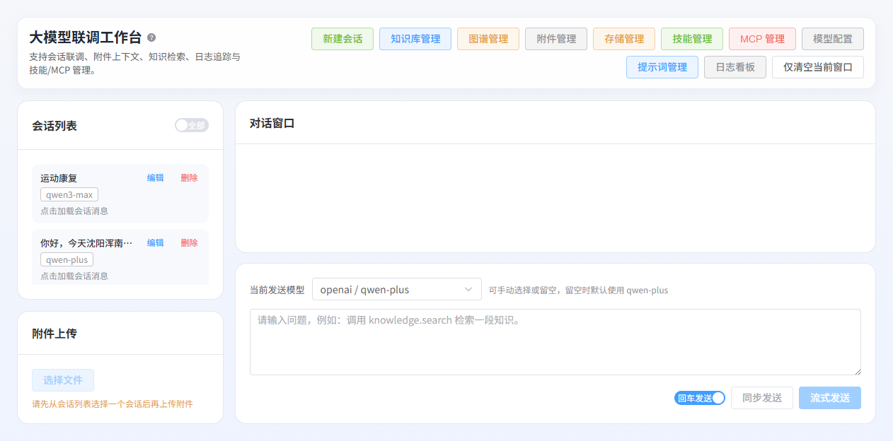
</p>
<p align="center"><em>图 1：联调工作台首页</em></p>

这个首页我个人非常喜欢的一点是：**它没有把页面做成“只有对话框”的极简玩具，而是直接把真正联调时需要跳转的入口全部摆在顶部。**

你可以直接看到：

- 知识库管理
- 图谱管理
- 附件管理
- 存储管理
- 技能管理
- MCP 管理
- 模型配置
- 提示词管理
- 日志看板

换句话说，这不是一个“聊天页”，而是一个**大模型能力联调总控台**。

---

## 三、工作台不是摆设，细节做得很实用

### 1）会话不是一次性的，而是可管理的

工作台左侧有完整的会话列表，支持：

- 新建会话
- 编辑会话
- 删除会话
- 按是否失败快速筛选
- 给会话指定默认模型

<p align="center">
  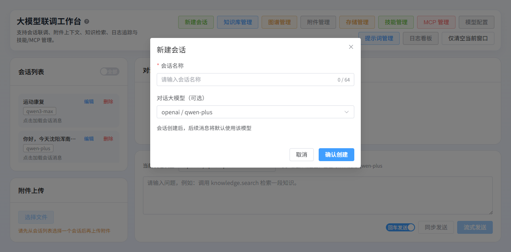
</p>
<p align="center"><em>图 2：新建会话弹窗</em></p>

<p align="center">
  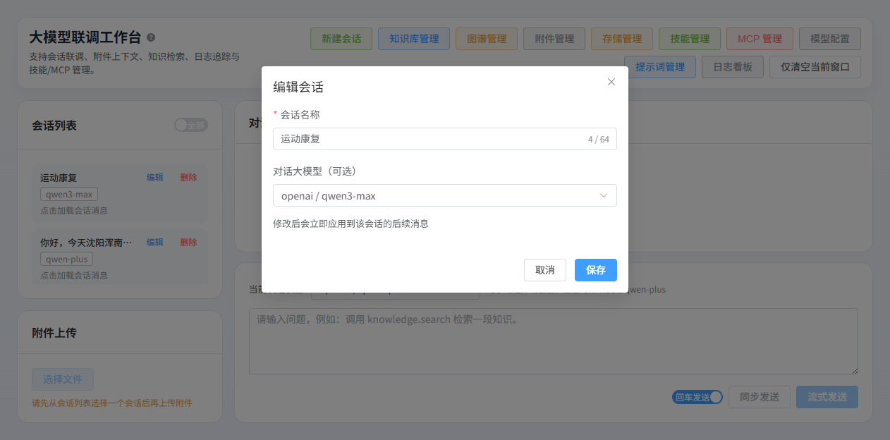
</p>
<p align="center"><em>图 3：编辑会话弹窗</em></p>

这里有个很实用的点：你不是只能“起一个 sessionId 然后继续聊”，而是可以给不同实验主题单独建会话。比如：

- 一个会话专门测 `qwen-plus`
- 一个会话测 `qwen-max`
- 一个会话专门挂知识库
- 一个会话拿来跑附件总结

这样你在对比模型、排查异常、给别人演示时，思路会非常清晰。

### 2）同步发送和流式发送都能直接验证

这是我很看重的一个点。

很多项目只有流式，没有同步；或者只有同步，没有流式。结果一出问题，你都不知道是接口问题、前端展示问题，还是 SSE 问题。

`gijela-core-chat` 直接把两种方式都摆出来：

- `同步发送`
- `流式发送`

并且两种实际效果都能在工作台里直观看到。

<p align="center">
  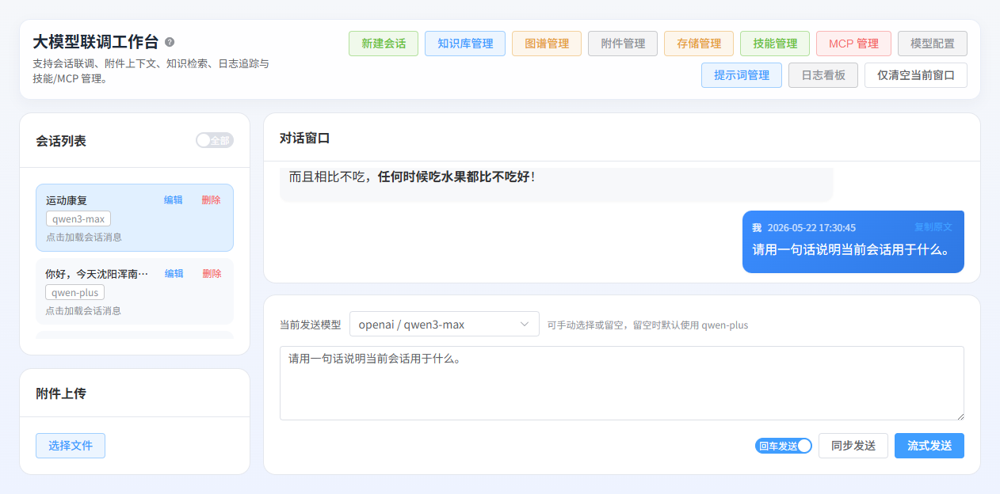
</p>
<p align="center"><em>图 4：同步发送响应效果</em></p>

<p align="center">
  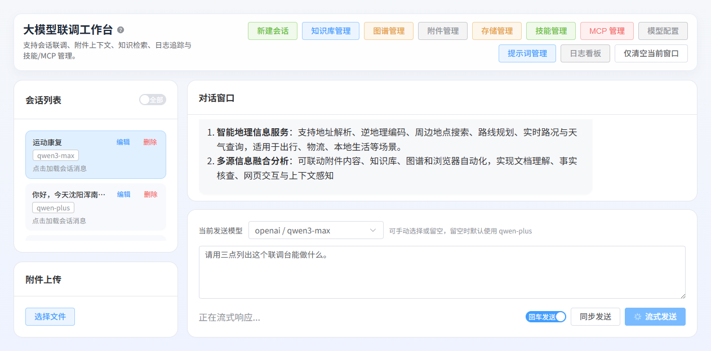
</p>
<p align="center"><em>图 5：流式发送响应效果</em></p>

这有什么价值？

很简单：

- 同步适合快速判断接口能不能跑通
- 流式适合看增量输出、工具调用过程和响应节奏

你做联调的时候，不需要切 Postman、不需要自己拼流式客户端，直接在页面里就能看。

### 3）附件链路不是“上传完就没了”

工作台左侧就能直接绑定当前会话上传附件，这一点也很关键。

因为真实业务里，附件通常不是孤立存在，而是和某次会话、某条上下文、某次问答绑定的。

这意味着你可以非常自然地测试：

- 上传文件
- 文件是否处理成功
- 是否生成摘要
- 是否能参与后续问答

这就比“单独写一个上传接口，传完去数据库看结果”高级太多了。

---

## 四、知识库管理：不是只告诉你“写入成功”，而是让你现场验证 RAG

RAG 这块，很多项目的问题是：

- 写入成功了，但不知道写了什么
- 向量集合创建了，但不知道维度对不对
- 检索接口有返回，但不知道命中的到底是不是想要的内容

`gijela-core-chat` 直接给你一整页知识库管理来解决这些问题。

<p align="center">
  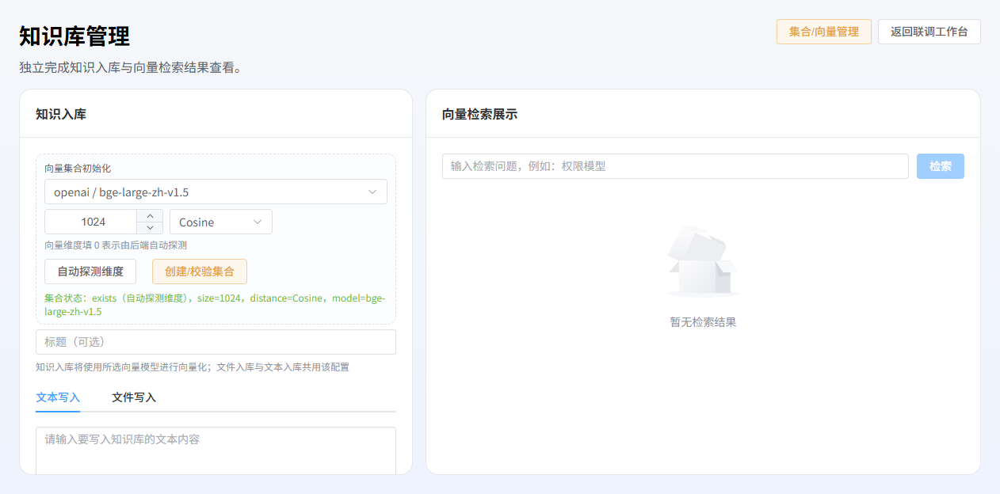
</p>
<p align="center"><em>图 6：知识库管理页面</em></p>

这个页面里能做的事情非常完整：

- 选择向量模型
- 自动探测维度
- 创建 / 校验集合
- 文本写入知识库
- 文件写入知识库
- 设置 chunk size 和 overlap
- 输入检索问题
- 直接看向量命中结果

更重要的是，它不是只做“新增”，还把“清理”和“治理”考虑进去了。

<p align="center">
  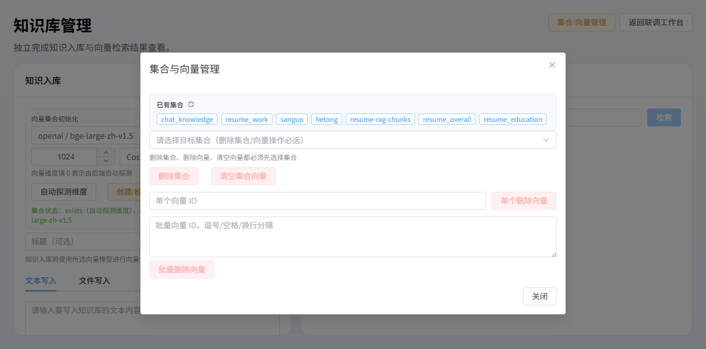
</p>
<p align="center"><em>图 7：集合与向量管理弹窗</em></p>

你可以：

- 删除集合
- 清空集合向量
- 删除单个向量
- 批量删除向量

这意味着什么？

意味着你不只是“会入库”，而是真正能反复做实验、清理实验数据、重置测试环境。

如果你以前调 RAG 是靠不停改 SQL、删 collection、跑脚本，那你会很懂这种统一页面的价值。

---

## 五、图谱管理：这不是概念展示，而是能把抽取结果摊开给你看

如果说知识库页解决的是 RAG 联调，那么图谱页解决的是另一个更容易“黑箱化”的问题：

> 图谱抽取到底抽出了什么？

很多图谱抽取项目的问题在于：

- 调了接口，但实体关系只在 JSON 里
- 想看效果，要么看数据库，要么看日志
- 一旦结果不理想，不知道是模型抽错了，还是导入逻辑有问题

`gijela-core-chat` 的图谱管理页做得比较“联调友好”。

<p align="center">
  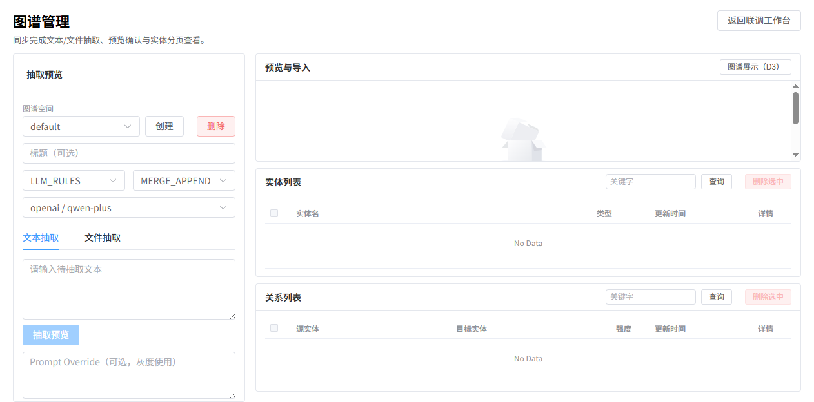
</p>
<p align="center"><em>图 8：图谱管理页面</em></p>

<p align="center">
  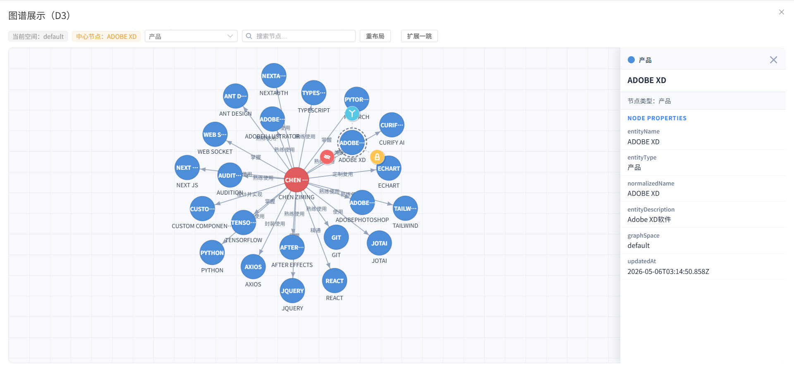
</p>
<p align="center"><em>图 9：知识图谱3D展示效果</em></p>

你可以在这一页做完整的链路验证：

- 创建图谱空间
- 输入文本做抽取预览
- 上传文件做抽取预览
- 选择抽取模式和导入模式
- 指定图谱抽取模型
- 先看实体和关系预览
- 再点“确认入图”
- 最后看实体列表和关系列表

这套流程最有价值的一点是：**它把“预览”和“导入”拆开了。**

这个设计特别适合联调和演示，因为你可以先告诉别人：

- 模型抽出了哪些实体
- 它们之间有哪些关系
- 如果确认没问题，再导入

这比“直接调接口写图数据库，出了问题再倒推”要优雅太多。

---

## 六、附件管理：把文件处理链路真正做成可视化验证

很多项目做附件功能时，到“能上传”就结束了。

但如果你是做大模型场景，附件上传之后真正关心的是：

- 文件是否处理成功
- 摘要是否正确
- 原文是否提取完整
- 浓缩 Markdown 是否可读
- 会不会卡在处理中

`gijela-core-chat` 的附件管理页，就是专门把这条链路摆到明面上。

<p align="center">
  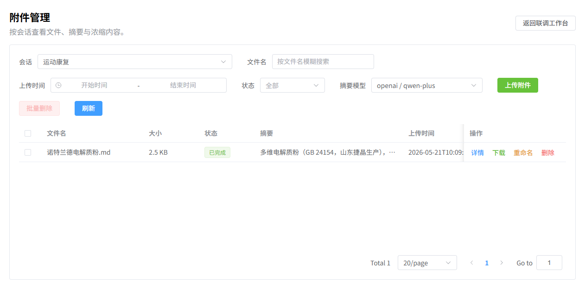
</p>
<p align="center"><em>图 10：附件管理页面</em></p>

它支持：

- 按会话查看附件
- 按文件名、时间、状态筛选
- 上传附件
- 下载附件
- 重命名附件
- 删除附件
- 批量删除附件
- 打开详情看摘要和原文

详情页这一块尤其适合联调。

<p align="center">
  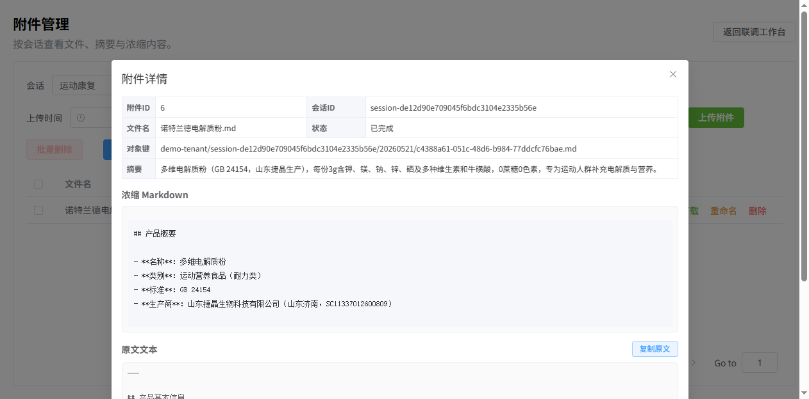
</p>
<p align="center"><em>图 11：附件详情弹窗</em></p>

你可以直接看到：

- 附件 ID
- 绑定会话
- 处理状态
- 摘要内容
- 浓缩 Markdown
- 原文文本

这就意味着，如果摘要不对、提取不全、处理异常，你不需要再跑到数据库或对象存储里慢慢翻。

同时，连重命名和删除这种“看起来不高级、但实际演示和回归都很需要”的动作，也补齐了。

<p align="center">
  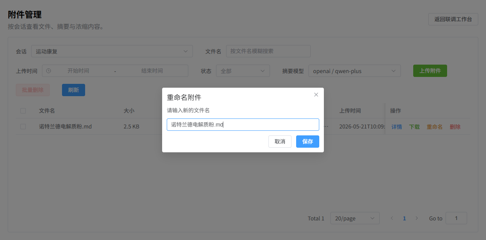
</p>
<p align="center"><em>图 12：附件重命名弹窗</em></p>

<p align="center">
  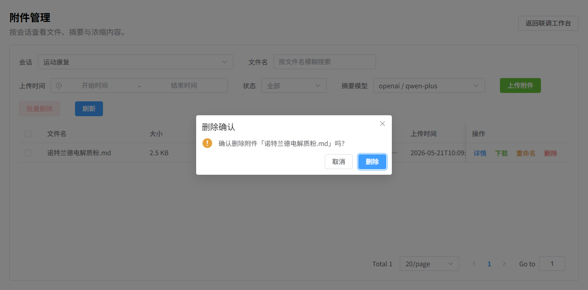
</p>
<p align="center"><em>图 13：附件删除确认弹窗</em></p>

这类“边角功能”做全，往往意味着这个页面不是为了凑功能，而是真的为了让人用。

---

## 七、对象存储管理：这不是花活，是联调时非常有用的兜底页

很多人会忽略“对象存储管理”这种页面，觉得没必要。

但实际联调时，它非常有价值。

为什么？

因为当附件上传、下载、对象删除出了问题时，你需要快速回答一个问题：

> 是业务逻辑有问题，还是对象存储本身就没通？

这时候，一个单独的对象存储管理页就特别有用。

<p align="center">
  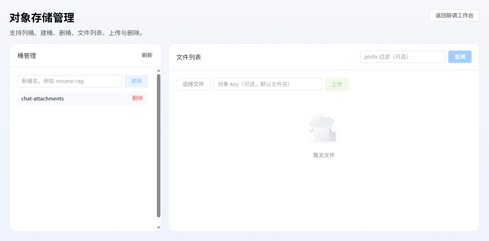
</p>
<p align="center"><em>图 14：对象存储管理页面</em></p>

你可以直接做：

- 列桶
- 建桶
- 删除桶
- 按 prefix 查对象
- 上传对象
- 下载对象
- 删除对象

这样你就能把“附件业务链路问题”和“对象存储基础链路问题”分离开。

联调里最怕的不是报错，而是混在一起看不清。

---

## 八、技能管理：Skill 终于不是只存在于配置和代码里了

如果你的项目用了 Skill 机制，你肯定知道一个常见尴尬：

- Skill 目录里明明有文件
- 后端也启动了
- 但到底有没有加载成功，只有代码里的人知道

`gijela-core-chat` 把 Skill 管理直接做成了一页。

<p align="center">
  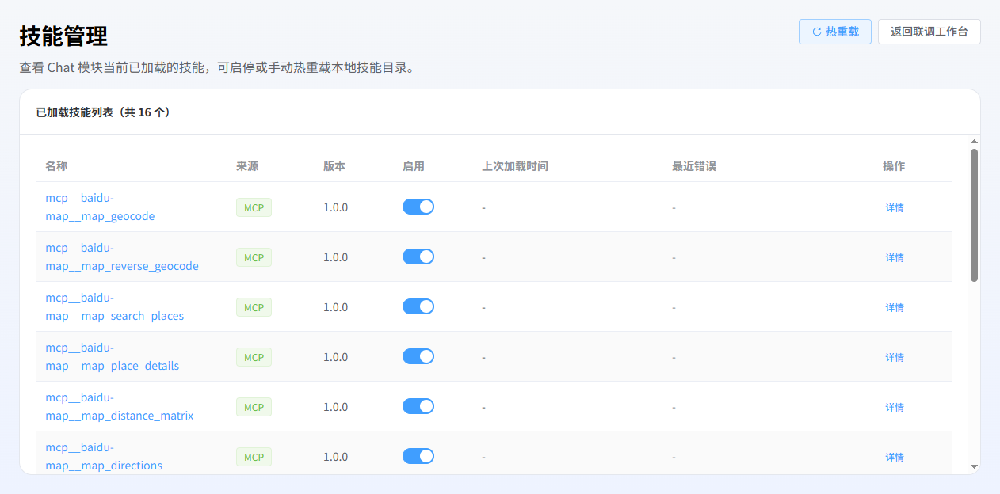
</p>
<p align="center"><em>图 15：技能管理页面</em></p>

这里能直接看到：

- 名称
- 来源（内置 / 本地）
- 版本
- 是否启用
- 上次加载时间
- 最近错误

这最后一列“最近错误”其实特别重要。

因为联调时 Skill 失效，很多时候不是“没有注册”，而是：

- 清单格式错了
- Schema 有问题
- 加载过程异常

如果没有页面可视化，你通常只能翻日志。

现在你在列表里就能看到一手线索。

而且详情页也做了。

<p align="center">
  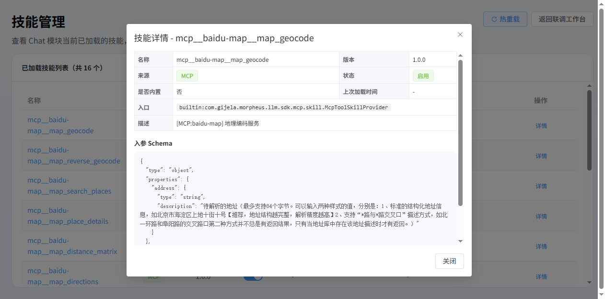
</p>
<p align="center"><em>图 16：技能详情弹窗</em></p>

它会把：

- 入参 Schema
- 入口文件
- 描述
- `SKILL.md`

都摊给你看。

如果你是做 Skill 联调，这个页面真的很省时间。

---

## 九、MCP 管理：终于不用在配置文件里盲调 MCP 了

这部分我觉得是整套 `chat` 工作台里最“对味”的一块。

因为现在大家谈 MCP 很多，但真正落到项目里时，常见状态是：

- 配了 endpoint，不知道能不能连
- 配了 bearer token，不知道生没生效
- 支持 SSE / stdio / HTTP，但没人知道怎么验证
- 工具数到底有没有拉回来，也不清楚

`gijela-core-chat` 直接把 MCP Server 管理做成了完整页面。

<p align="center">
  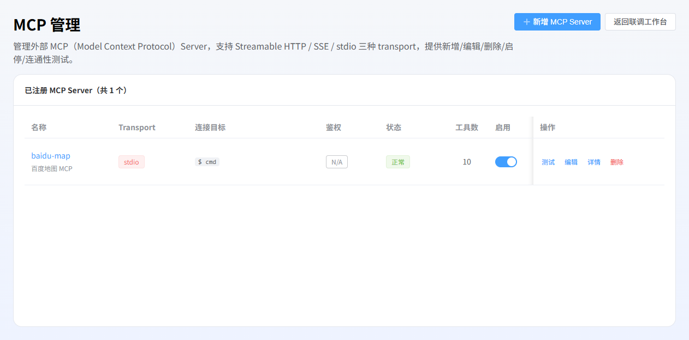
</p>
<p align="center"><em>图 17：MCP 管理页面</em></p>

这页支持：

- 新增 MCP Server
- 编辑 MCP Server
- 删除 MCP Server
- 启用 / 禁用
- 测试连通性
- 查看工具数
- 查看状态与状态消息

新增弹窗也做得很完整：

<p align="center">
  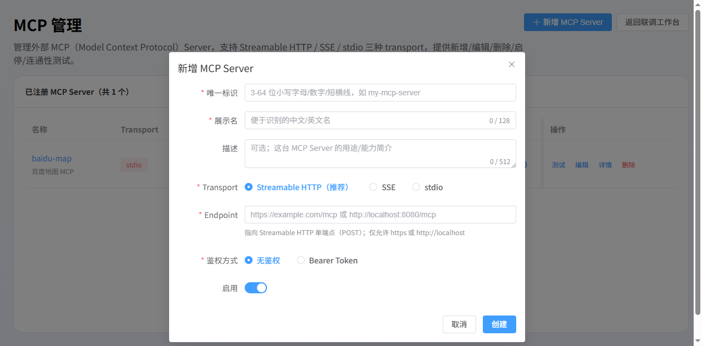
</p>
<p align="center"><em>图 18：新增 MCP Server 弹窗</em></p>

编辑和详情也补齐了：

<p align="center">
  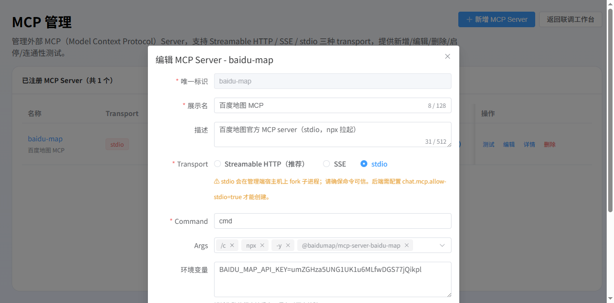
</p>
<p align="center"><em>图 19：编辑 MCP Server 弹窗</em></p>

<p align="center">
  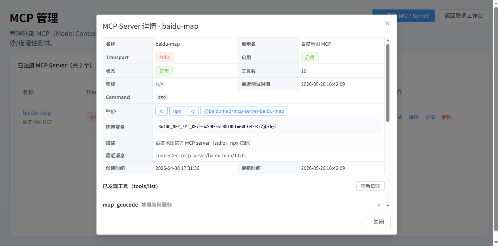
</p>
<p align="center"><em>图 20：MCP 详情弹窗</em></p>

这意味着什么？

意味着你终于可以把 MCP 当成一个“可运维、可观察、可演示”的对象，而不是只存在于 `application.yml` 里的几行配置。

这对于真正想把 MCP 落进业务项目的人来说，非常关键。

---

## 十、模型配置管理：让“换模型”变成后台动作，而不是改配置重启

很多项目做模型接入时，一开始没觉得有什么问题。

直到后来接入：

- 不同对话模型
- 不同向量模型
- 不同 baseUrl
- 不同 API Key
- 不同超时策略

然后就开始乱了。

`gijela-core-chat` 专门给模型配置做了一页。

<p align="center">
  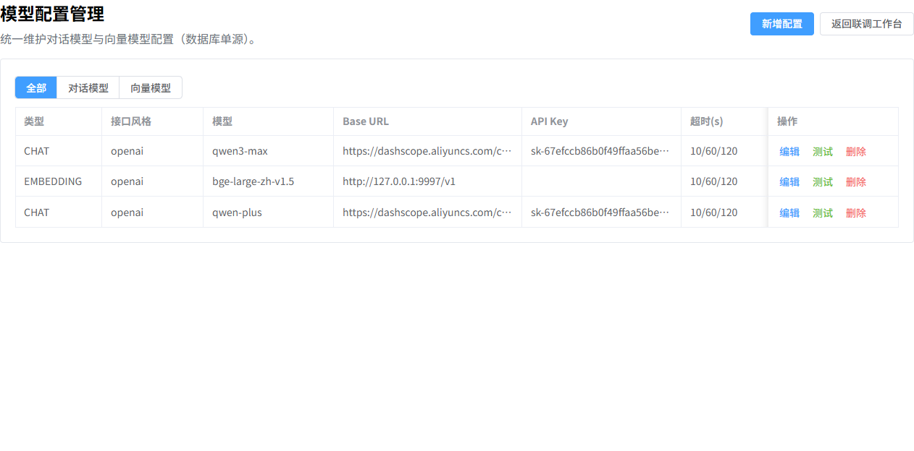
</p>
<p align="center"><em>图 21：模型配置管理页面</em></p>

你可以：

- 新增配置
- 编辑配置
- 删除配置
- 按对话模型 / 向量模型过滤
- 对配置做连通性测试

新增和编辑弹窗也做了：

<p align="center">
  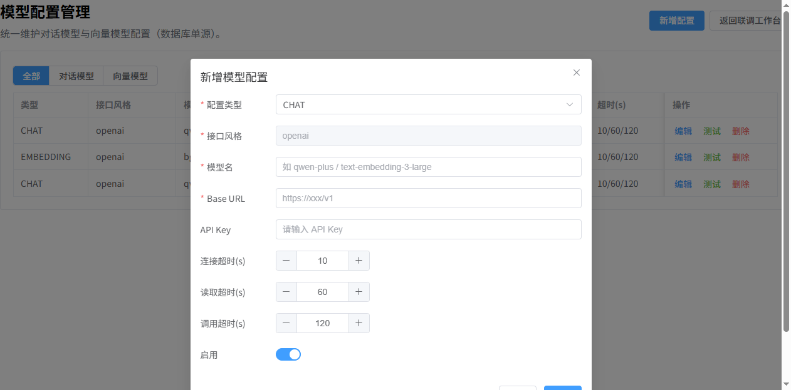
</p>
<p align="center"><em>图 22：新增模型配置弹窗</em></p>

<p align="center">
  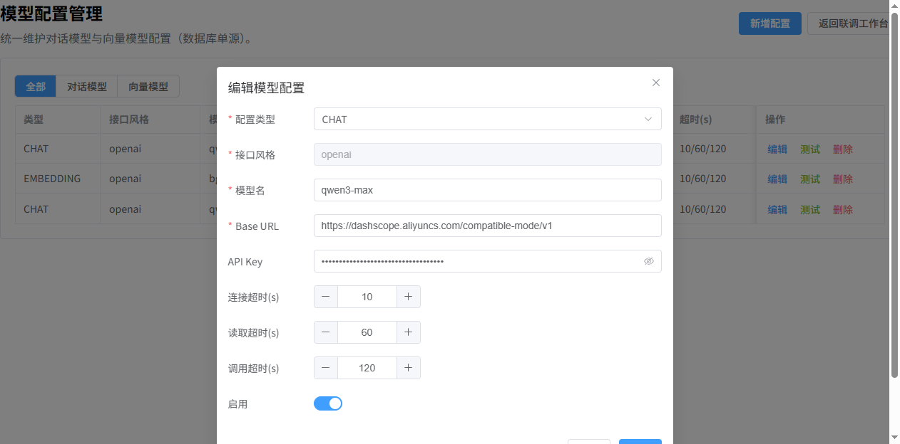
</p>
<p align="center"><em>图 23：编辑模型配置弹窗</em></p>

这页的价值很直接：

- 模型接入不再靠改文件
- 测试人员也能自己验证配置是否可用
- 不同模型切换、对比和回归更容易做

一句话：**把“模型接入”从开发动作变成了可视化管理动作。**

---

## 十一、提示词管理：终于不是“改 prompt 只能改代码”了

做大模型项目，提示词一定会反复改。

但很多项目的 prompt 仍然停留在：

- 写死在代码里
- 放在配置里
- 改完要重启
- 很难区分系统级和会话级

`gijela-core-chat` 的提示词管理页，把这块做得很适合实验。

<p align="center">
  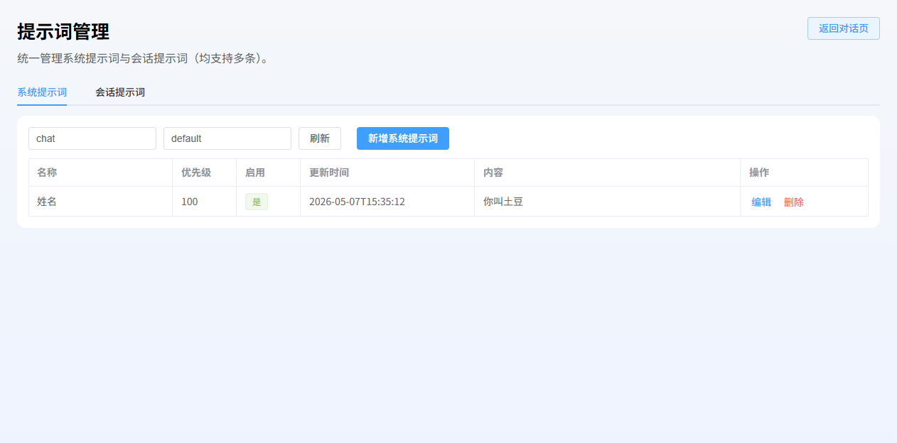
</p>
<p align="center"><em>图 24：提示词管理页面</em></p>

它分成两类：

- 系统提示词
- 会话提示词

你可以：

- 新增系统提示词
- 编辑系统提示词
- 删除系统提示词
- 按会话查看会话提示词
- 新增 / 编辑 / 删除会话提示词

新增、编辑、删除确认都补了：

<p align="center">
  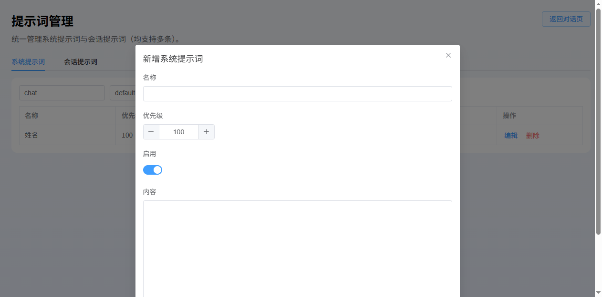
</p>
<p align="center"><em>图 25：新增系统提示词弹窗</em></p>

<p align="center">
  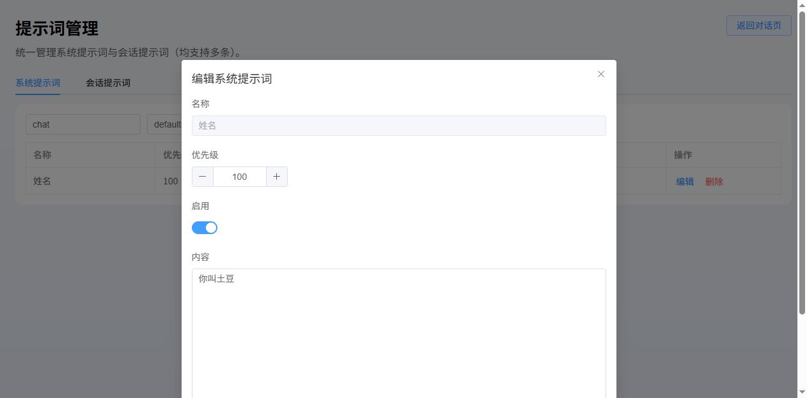
</p>
<p align="center"><em>图 26：编辑提示词弹窗</em></p>

<p align="center">
  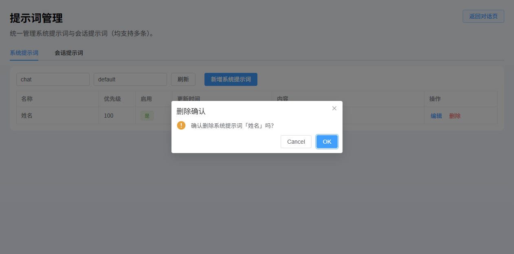
</p>
<p align="center"><em>图 27：删除提示词确认弹窗</em></p>

这块最适合拿来做：

- 回答风格实验
- 不同系统设定对比
- 针对特定会话的局部覆盖

如果你做 prompt 工程，这页会非常顺手。

---

## 十二、日志看板：真正把“出问题去哪看”这件事解决了

很多 LLM 项目最缺的不是功能，而是排障入口。

一旦出问题，你就会遇到这些经典场景：

- 页面能打开，但消息没返回
- 模型能调用，但结果不对
- MCP 配了，但工具没生效
- 知识库写入了，但召回怪怪的

这时候如果只有控制台日志，那体验会非常差。

`gijela-core-chat` 把日志看板单独做成了一套页面：

- 概览
- 审计
- 告警
- 排障

### 1）概览页

<p align="center">
  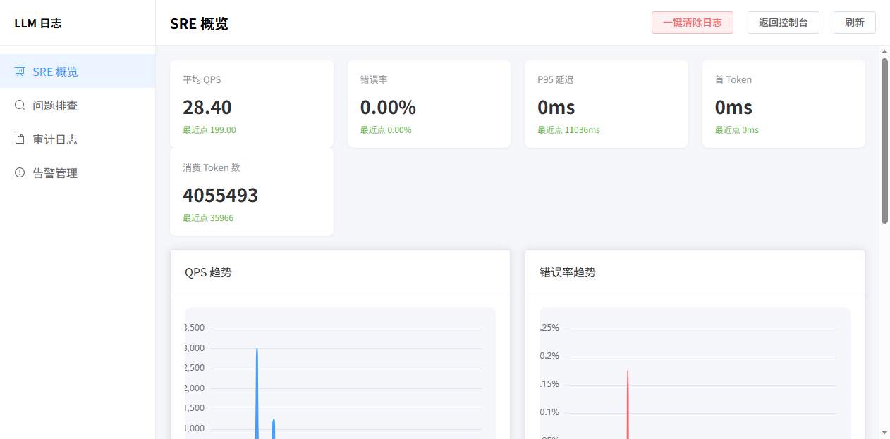
</p>
<p align="center"><em>图 28：日志概览页面</em></p>

适合快速判断当前整体状态是否异常。

### 2）审计页

<p align="center">
  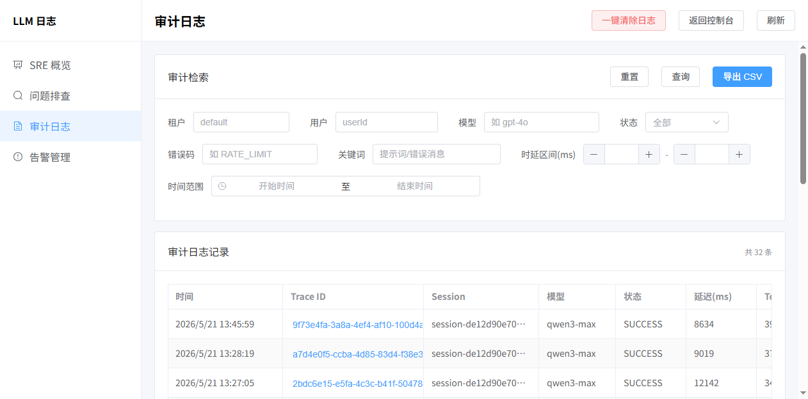
</p>
<p align="center"><em>图 29：日志审计页面</em></p>

适合追具体请求、调用记录和关键明细。

### 3）告警页

<p align="center">
  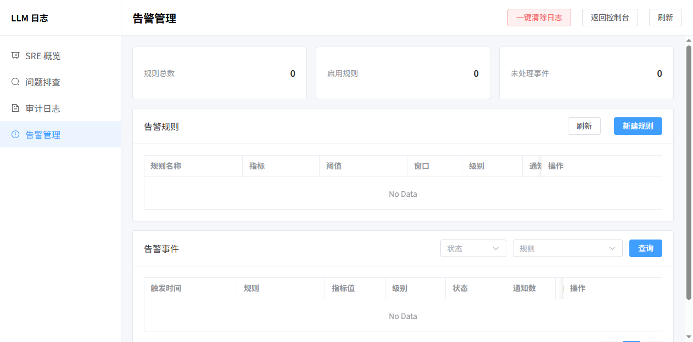
</p>
<p align="center"><em>图 30：日志告警页面</em></p>

适合看规则和异常状态。

### 4）问题排查页

<p align="center">
  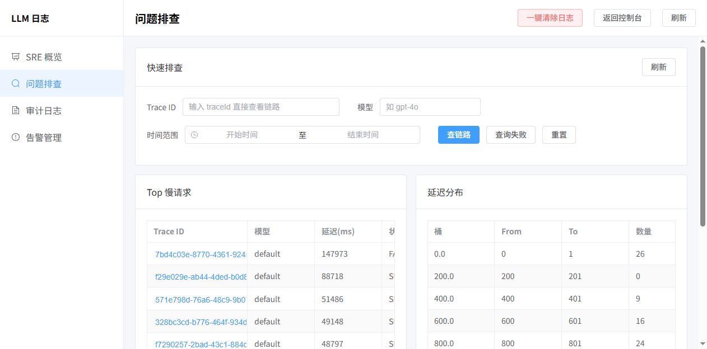
</p>
<p align="center"><em>图 30：问题排查页面</em></p>

适合做慢请求、失败链路、异常定位。

这一套最打动我的地方是：**它承认了“联调一定会出问题”，并且给了你一个正经的排障入口。**

很多 demo 只管“能跑”，`gijela-core-chat` 已经开始考虑“跑歪了怎么办”。

---

## 十三、如果你要快速体验，我建议按这个顺序

如果你今天第一次跑 `gijela-core-chat`，我建议这样体验：

### 第一步：先配模型

先去模型配置页，确保至少有一条可用的对话模型配置，最好再有一条向量模型配置。

### 第二步：去工作台发一条同步，再发一条流式

这样你能最快确认：

- 前端通了
- chat 后端通了
- 模型调用通了

### 第三步：写入一段知识，回工作台提问

这样你能把 RAG 主链路跑起来。

### 第四步：上传一个附件

确认摘要、原文、详情都能看到。

### 第五步：做一次图谱抽取预览

不用一开始就导入，先看看实体关系对不对。

### 第六步：看 Skill、MCP、日志页

把“管理面”和“排障面”也体验一遍，这样你对整套系统的认知才是完整的。

---

## 十四、为什么我觉得这套东西值得单独写一篇文章？

因为它不是一个“会说话”的页面，而是一套**真正面向联调和落地的 LLM 工作台**。

它让我觉得有价值的点，核心是这几个：

### 1）不是只做 happy path

它不只是让你发消息成功，而是把：

- 配置
- 实验
- 校验
- 管理
- 排障

这些真实工作流都放进去了。

### 2）不是把能力藏在后端

知识库、图谱、附件、Skill、MCP、Prompt、日志，全都有页面承接。

这意味着它不是“后端工程师自己知道怎么用”，而是真的能给团队协作用。

### 3）很适合做项目演示和交接

如果你要给同事、领导、客户、测试同学演示一个大模型项目，“只有一个聊天页”其实很难讲清楚价值。

但如果你把这套页面打开，基本就能把下面这些全讲出来：

- 模型怎么接
- RAG 怎么验
- 图谱怎么抽
- 附件怎么处理
- Skill / MCP 怎么接
- Prompt 怎么实验
- 出问题去哪看

这就是完整度。

---

## 十五、如果你也在做 Java + LLM 项目，我真心建议你看看这套思路

你不一定要一模一样照搬 `gijela-core-chat`。

但我非常建议你参考它背后的思路：

> 不要把大模型项目只做成一个“能聊天的接口”，而是尽量做成一个“可联调、可验证、可演示、可排障”的能力工作台。

因为真正让团队效率拉开的，往往不是“你能不能调通模型”，而是：

- 你能不能让别人也会用
- 你能不能快速验证链路
- 你能不能出问题时迅速定位
- 你能不能把一套能力清晰地展示出来

从这个角度说，`gijela-core-chat` 给我的启发其实不只是一个模块，而是一种做 LLM 业务承载面的方式。

---

## 十六、后端和前端模块说明 + 项目部署

你现在看到的所有页面和功能，是由两个模块协作完成的。如果你想自己跑起来或贡献代码，这一节会帮你快速定位。

### 后端模块：`gijela-core-chat`

- **位置**：`gijela-core/gijela-core-chat/`
- **技术栈**：Spring Boot 3.x、Spring Security、MyBatis-Plus、Redis、JWT
- **职责**：
  - 大模型接入与调用（基于自研 OkHttp LLM SDK）
  - RAG 知识库管理与检索
  - 图谱抽取与存储
  - 附件处理与摘要生成
  - Skill 与 MCP 集成
  - 提示词管理
  - 日志审计与告警
  - 用户认证与权限控制
- **核心依赖**：
  - `gijela-core-llm`（自研 LLM 调用工具链，基于 OkHttp）
  - `gijela-core-security-common`（安全认证框架）
  - `gijela-core-common`（通用工具库）

### 前端模块：`gijela-bloom-chat`

- **位置**：`gijela-bloom/gijela-bloom-chat/`
- **技术栈**：Vue 3、TypeScript、Vite、Pinia、Element Plus、Axios
- **职责**：
  - 提供完整的联调工作台 UI
  - 会话管理与展示
  - 同步 / 流式消息收发
  - 知识库、图谱、附件、MCP、Skill 等各模块的管理界面
  - 模型配置、提示词管理页面
  - 日志看板（概览、审计、告警、排障）
  - 用户登录与会话管理
- **对接后端**：通过 RESTful API 与 `gijela-core-chat` 通信

### 本地开发启动

**方式 1：原生启动（开发调试推荐）**

```bash
# 后端启动（需要 Java 21 + Maven）
cd gijela-core
mvn -pl gijela-core-chat -am install -DskipTests
cd gijela-core-chat
mvn spring-boot:run -Dspring-boot.run.main-class=com.gijela.morpheus.chat.GijelaCoreChatApplication

# 前端启动（需要 Node.js + pnpm）
cd gijela-bloom/gijela-bloom-chat
pnpm install
pnpm dev
```

访问地址：
- 前端：`http://localhost:5174/`
- 后端 API：`http://localhost:8081/`

### Docker 部署（生产推荐）

**数据库初始化脚本**：
- 位置：`gijela-core/gijela-core-chat/src/main/resources/sql/`
- 包含：数据库 Schema、初始数据、权限配置

**Docker 相关文件**：
- 后端 Dockerfile：`gijela-core/gijela-core-chat/Dockerfile`
- 前端 Dockerfile：`gijela-bloom/gijela-bloom-chat/Dockerfile`
- Docker Compose：仓库根目录下的 `docker-compose.yml`

**使用 Docker Compose 快速启动（推荐）**：

```bash
# 在仓库根目录执行
docker-compose up -d

# 查看启动日志
docker-compose logs -f gijela-core-chat
docker-compose logs -f gijela-bloom-chat

# 停止容器
docker-compose down
```

所需的 SQL 初始化会在容器启动时自动执行，无需手动操作。

### 项目代码地址

如果你想看源码或参与贡献：

- **GitHub**：https://github.com/wojiaozhangtudou/gijela
- **Gitee**：https://gitee.com/zhangjq123/gijela

### 扩展阅读

- 图文操作手册：`gijela-core/gijela-core-chat/doc/chat-操作手册.md`
- 后端架构说明：`gijela-core/README.md`
- 前端项目说明：`gijela-bloom/gijela-bloom-chat/README.md`

---

## 十七、最后一句

如果你也受够了“一个输入框 + 一个接口 + 一句能跑”的 LLM demo，
那我建议你认真看看 `gijela-core-chat`。

它做的不是最花哨的页面，
但它很像一套**真正准备往工程里落的联调工作台**。

这类东西，越做项目，越知道它值钱。
