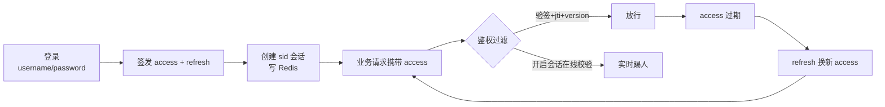
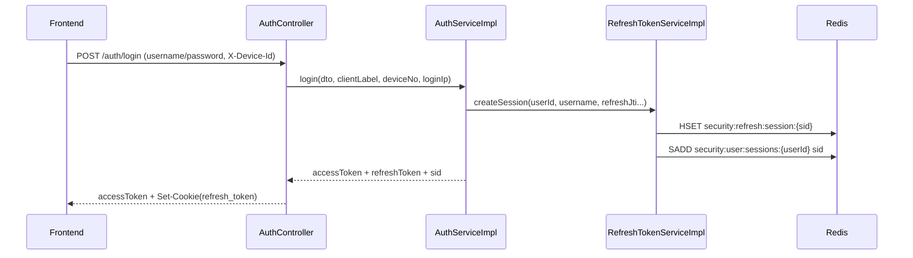
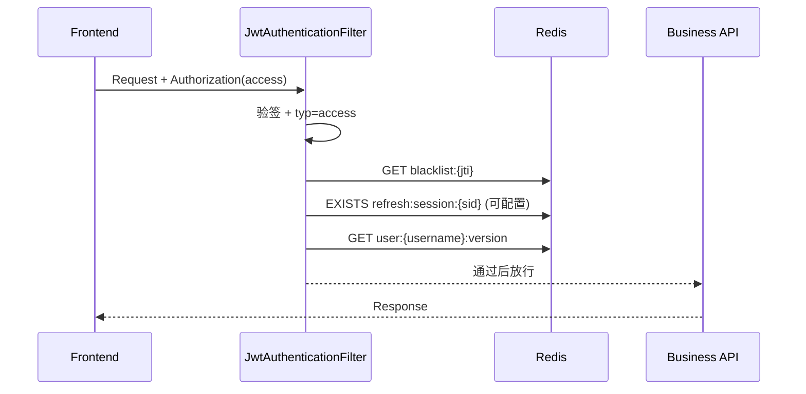
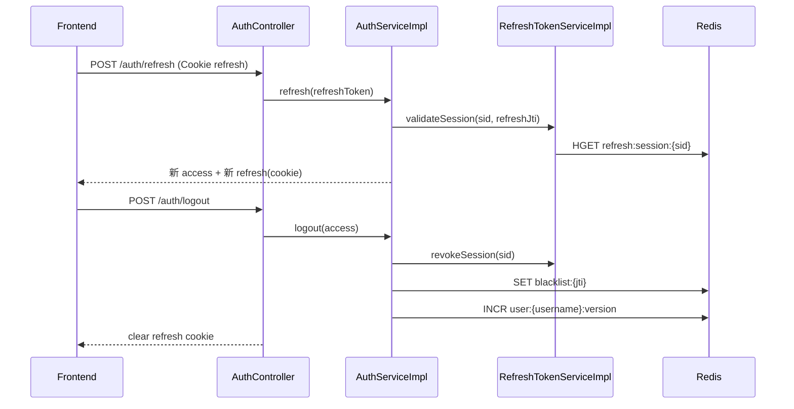

# 双 Token 落地手册：gijela 工程实现全拆解（可直接对照代码）

> 目标：把 gijela 当前“双 Token + 会话化治理”拆到工程级细节，做到“看完能改、改完能跑、跑完可验收”。

> 适合读者：后端开发、全栈开发、架构评审同学；尤其适合要从“JWT 可用”升级到“登录态可治理”的团队。

### 3 行导读

1. 本文是“工程实现手册”，重点讲**代码位置 + 运行机制 + 可验证步骤**。  
2. 你可以按本文从配置、鉴权、会话、前端刷新一路对照到具体文件。  
3. 文末附了本地联调、验收清单和 FAQ，可直接用于自测与上线前检查。

先看结论：如果你现在只做了“access 过期就 refresh”，那你解决的是“可用”；本文解决的是“可控 + 可追溯 + 可运营”。

### 快速导航（赶时间先看这些）

- 想看配置怎么开关：看 [7. 关键配置清单（建议）](#7-关键配置清单建议)
- 想看代码改哪里：看 [11. 核心代码位置速查](#11-核心代码位置速查)
- 想看真实链路：看 [12. 关键时序图（Mermaid）](#12-关键时序图mermaid)
- 想快速联调：看 [13. 本地联调步骤（可直接执行）](#13-本地联调步骤可直接执行)
- 想上线前自检：看 [14. 验收清单（建议每次发布前过一遍）](#14-验收清单建议每次发布前过一遍)

### 一分钟看懂这套实现



---

## 1. 工程位置总览

- 后端主模块：`gijela-core/gijela-core-pistil`
- 安全公共模块：`gijela-core/gijela-core-security-common`
- 前端主模块：`gijela-bloom/gijela-bloom-pistil`

双 Token 的关键逻辑分布在：

- 鉴权与 JWT 基础能力（公共）：`gijela-core-security-common`
- 认证业务（登录/刷新/会话/踢出）：`gijela-core-pistil`
- 前端无感刷新与会话管理 UI：`gijela-bloom-pistil`

---

## 2. 当前方案定义

当前并不是“只有一种双 Token”，而是**同一套代码支持两种运行模式**：

1. 经典模式（偏性能）：
	- Access 主要本地验签
	- 不做每次会话在线校验
	- 踢人常见为“延迟生效”

2. 增强模式（偏可控）：
	- Access 鉴权时增加 sid 在线态校验
	- 支持“下一次请求立即失效”

切换方式：

- `security.jwt.enableAccessSessionCheck=true|false`

---

## 3. Token 与会话模型

### 3.1 Access Token（短期）

- 用途：业务接口访问
- 当前过期：30 分钟（`accessExpMinutes`）
- 携带关键声明：`typ=access`、`jti`、`tokenVersion`、`sid`

### 3.2 Refresh Token（长期）

- 用途：换新 access
- 当前过期：7 天（`refreshExpDays`）
- 携带关键声明：`typ=refresh`、`jti`、`sid`

### 3.3 会话实体（Redis）

会话主键：`sid`（登录会话 ID）

会话字段（当前实现）：

- `userId`
- `username`
- `loginAt`
- `lastActiveAt`
- `refreshJtiHash`
- `clientLabel`
- `deviceNo`
- `loginIp`

---

## 4. Redis Key 设计

### 4.1 刷新会话键

- `security:refresh:session:{sid}`
- 含会话明细 + refresh jti hash

### 4.2 用户会话索引

- `security:user:sessions:{userId}`
- Redis Set，存该用户所有 `sid`

### 4.3 Access 黑名单

- `security:blacklist:{jti}`
- 用于 access 即时吊销

### 4.4 tokenVersion 键

- `security:user:{username}:version`
- 用于全局失效（登出/全踢/权限变更等）

---

## 5. 后端实现细节

### 5.1 配置入口（security-common）

配置类：`JwtProperties`

关键项：

- `accessExpMinutes`
- `refreshExpDays`
- `refreshKeyPrefix`
- `blacklistKeyPrefix`
- `enableAccessSessionCheck`
- `maxSessionsPerUser`
- `allowQueryToken` / `allowCookieToken`

默认配置文件：

- `gijela-core/gijela-core-security-common/src/main/resources/application-security-common.yml`

### 5.2 鉴权过滤器

过滤器在 access 鉴权阶段执行：

1. 验签/过期校验
2. 类型校验（必须 `typ=access`）
3. 黑名单校验（`jti`）
4. 可选 sid 在线校验（开关控制）
5. tokenVersion 校验

核心价值：

- 在增强模式下实现“实时踢人”

### 5.3 认证控制器

控制器：`AuthController`

核心接口：

- `POST /api/v1/auth/login`
- `POST /api/v1/auth/refresh`
- `POST /api/v1/auth/logout`
- `GET /api/v1/auth/sessions`
- `POST /api/v1/auth/sessions/page`
- `POST /api/v1/auth/sessions/{sessionId}/kickout`
- `POST /api/v1/auth/sessions/kickout-all`

登录时会从请求提取：

- `X-Client-Label`
- `X-Device-Id`
- `X-Forwarded-For` / `X-Real-IP` / `RemoteAddr`

并写入会话字段 `clientLabel/deviceNo/loginIp`。

### 5.4 认证服务

服务实现：`AuthServiceImpl`

关键逻辑：

1. `login(...)`
	- 用户校验
	- 会话上限校验（`maxSessionsPerUser`）
	- 创建会话并签发 access/refresh

2. `refresh(...)`
	- refresh 类型校验
	- sid + refreshJti 一致性校验
	- 续签并更新会话活跃时间

3. `logout(...)`
	- 撤销当前会话
	- access jti 入黑名单
	- tokenVersion 递增

4. `kickoutSession(...)` / `kickoutAllSessions(...)`
	- 单会话/全会话治理

### 5.5 Refresh 会话服务

实现类：`RefreshTokenServiceImpl`

职责：

- 创建会话
- 刷新会话
- 校验会话
- 撤销会话
- 查询会话列表（用户维度/全量）
- 清理失效索引 sid

实现细节：

- refresh token 不明文入 Redis，只存 `refreshJtiHash`
- 索引与会话键解耦，支持高效按用户查询

---

## 6. 前端实现细节

### 6.1 axios 客户端策略

文件：`src/api/client.ts`

核心行为：

1. 默认 `withCredentials=true`
2. 请求头自动附加：
	- `Authorization`
	- `X-Device-Id`
	- `X-Client-Label`
3. 401 / 业务未登录码触发刷新
4. 刷新互斥（单飞）避免 refresh 风暴

### 6.2 token 存储策略

- access：前端内存态（不落 localStorage 持久化）
- refresh：HttpOnly Cookie（后端写入/清理）

### 6.3 登录与退出

`user.ts` 中：

- 登录成功后拉取用户信息与菜单
- 退出必须调用后端 `/auth/logout`，避免“会话残留占名额”

### 6.4 会话管理界面

页面：`src/views/system/SessionList.vue`

支持：

- 分页查询
- username 模糊筛选
- 单会话踢出
- 全部踢出
- 展示 `deviceNo/loginIp/clientLabel`

个人中心：

- `src/views/Profile.vue` 提供“登录设备管理”弹窗
- 不跳转页面即可管理当前用户会话

---

## 7. 关键配置清单（建议）

```yaml
security:
  jwt:
		accessExpMinutes: 30
		refreshExpDays: 7
		enableAccessSessionCheck: true
		maxSessionsPerUser: 1
		refreshRotateEnabled: true
```

说明：

- `enableAccessSessionCheck=true`：实时踢人
- `enableAccessSessionCheck=false`：经典模式
- `maxSessionsPerUser<=0`：不限制在线会话数

---

## 8. 运行时行为总结

1. 登录
	- 签发 access/refresh
	- 建立 sid 会话
	- 记录设备号/IP/客户端

2. 接口访问
	- access 验签
	- 黑名单 + tokenVersion
	- 可选 sid 在线校验

3. 刷新
	- refresh 校验
	- 会话续期

4. 退出/踢出
	- 撤销 sid
	- 必要时拉黑 access
	- 必要时递增 tokenVersion

---

## 9. 已解决的典型问题

- 踢了会话却还能继续操作
- 退出后仍占在线名额导致无法重新登录
- 无法识别可疑设备与来源 IP
- 会话只能按 userId 查，缺乏分页筛选
- 页面会话治理入口不足（已补会话页 + 个人弹窗）

---

## 10. 结论

gijela 当前双 Token 的价值不只是“登录成功”，而是：

- 可控（可踢、可失效、可限额）
- 可观测（设备号、IP、客户端）
- 可切换（性能优先 / 安全优先）
- 可落地（前后端链路完整、配置可运行）

这套实现适用于绝大多数“后台管理系统”的登录态治理场景。

---

## 11. 核心代码位置速查

后端：

- JWT 配置：`gijela-core/gijela-core-security-common/src/main/java/com/gijela/morpheus/security/config/JwtProperties.java`
- 鉴权过滤：`gijela-core/gijela-core-security-common/src/main/java/com/gijela/morpheus/security/filter/JwtAuthenticationFilter.java`
- 认证控制器：`gijela-core/gijela-core-pistil/src/main/java/com/gijela/morpheus/pistil/controller/AuthController.java`
- 认证服务：`gijela-core/gijela-core-pistil/src/main/java/com/gijela/morpheus/pistil/service/impl/AuthServiceImpl.java`
- 会话服务：`gijela-core/gijela-core-pistil/src/main/java/com/gijela/morpheus/pistil/service/impl/RefreshTokenServiceImpl.java`
- 会话 VO：`gijela-core/gijela-core-pistil/src/main/java/com/gijela/morpheus/pistil/domain/vo/LoginSessionVO.java`

前端：

- 请求与刷新：`gijela-bloom/gijela-bloom-pistil/src/api/client.ts`
- 会话 API：`gijela-bloom/gijela-bloom-pistil/src/api/auth.ts`
- 用户登录态：`gijela-bloom/gijela-bloom-pistil/src/store/user.ts`
- 会话管理页：`gijela-bloom/gijela-bloom-pistil/src/views/system/SessionList.vue`
- 个人中心设备弹窗：`gijela-bloom/gijela-bloom-pistil/src/views/Profile.vue`

---

## 12. 关键时序图（Mermaid）

### 12.1 登录与会话创建



### 12.2 Access 鉴权（增强模式）



### 12.3 刷新与退出



---

## 13. 本地联调步骤（可直接执行）

### 13.1 启动后端（pistil）

仓库根目录执行（Windows / PowerShell）：

1. 编译模块（跳过测试）：
	- `mvn -f gijela-core/pom.xml -pl gijela-core-pistil -am install -DskipTests`
2. 启动应用：
	- `mvn -f gijela-core/gijela-core-pistil/pom.xml spring-boot:run -Dspring-boot.run.main-class=com.gijela.morpheus.pistil.GijelaCorePistilApplication`

建议环境变量：

- `SPRING_PROFILES_ACTIVE=dev`

### 13.2 启动前端（pistil）

进入目录：`gijela-bloom/gijela-bloom-pistil`

```bash
pnpm dev
```

### 13.3 浏览器验证主流程

1. 登录后确认：
	- 能正常进入系统
	- `refresh_token` Cookie 已写入
2. 打开“会话管理”或“个人中心-登录设备管理”：
	- 可以看到 `sessionId/deviceNo/loginIp/clientLabel`
3. 在会话页执行单踢：
	- 目标会话下一次请求应失效（增强模式）
4. 点击退出：
	- 重新登录不会被“在线会话上限”误拦截

---

## 14. 验收清单（建议每次发布前过一遍）

1. 登录成功创建会话：
	- `security:refresh:session:{sid}` 存在，TTL 正确
2. 用户索引正确：
	- `security:user:sessions:{userId}` 包含 sid
3. 刷新链路正确：
	- 旧 refresh 不可重复利用（轮换场景）
4. 注销链路正确：
	- 会话撤销 + refresh cookie 清除
5. 单踢/全踢正确：
	- 目标会话或全部会话失效
6. 实时踢人开关正确：
	- `enableAccessSessionCheck=true` 实时生效
	- `enableAccessSessionCheck=false` 延迟生效
7. 在线数限制正确：
	- 达上限阻止新登录
	- 手动删会话后可再次登录
8. 设备追踪正确：
	- 会话记录中 `deviceNo/loginIp/clientLabel` 可见

---

## 15. 常见问题（FAQ）

### Q1：为什么退出后还会出现“在线数已满”？

通常是前端没有调用后端 `/auth/logout`，只清了本地 token。  
排查重点：`user.ts` 的 `logout()` 是否真正发起了后端请求。

### Q2：为什么踢出后对方还没马上掉线？

检查 `security.jwt.enableAccessSessionCheck`：

- `true`：下一次请求应立即失效
- `false`：一般等 access 过期才体现

### Q3：deviceNo 不是“真实硬件号”吗？

当前不是。它是前端生成并持久化的“客户端设备标识”，用于会话治理与追踪，不等价于物理硬件唯一 ID。

### Q4：线上有网关时 IP 为何不准？

需确保网关正确透传：

- `X-Forwarded-For`
- `X-Real-IP`

后端才可以优先解析真实客户端 IP。

---

## 16. 项目地址

如果你想直接对照本文查看完整实现，可访问：

- GitHub：https://github.com/wojiaozhangtudou/gijela
- Gitee：https://gitee.com/zhangjq123/gijela

管理后台相关目录：

- 后端：`gijela-core/gijela-core-pistil`
- 前端：`gijela-bloom/gijela-bloom-pistil`

